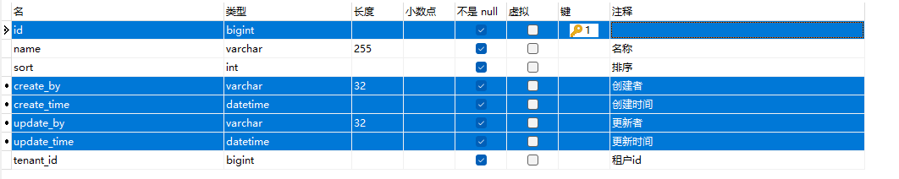
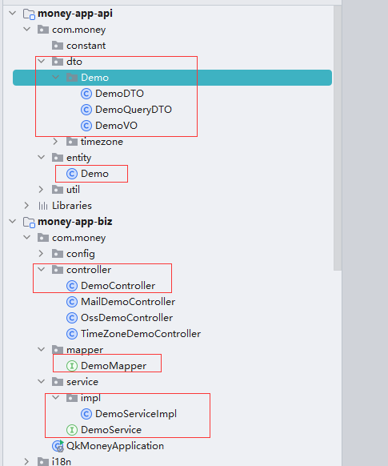
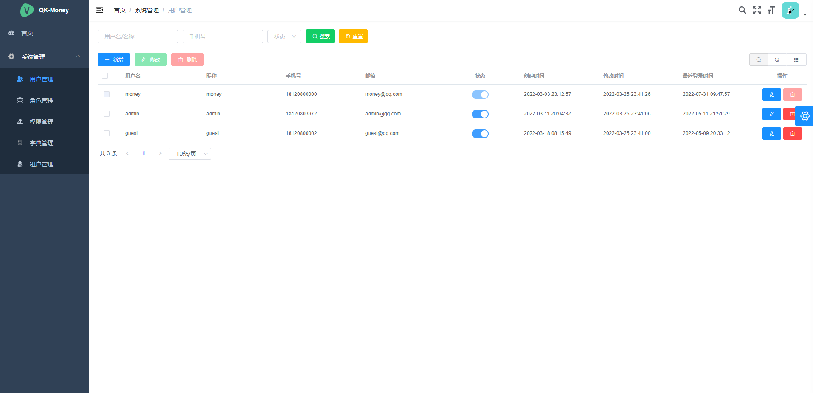
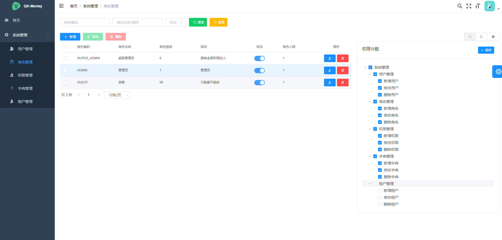
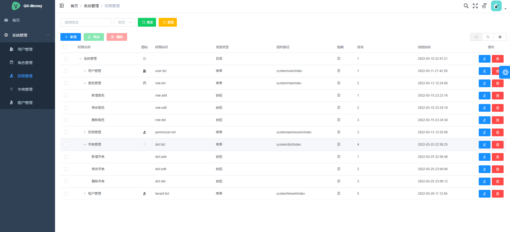
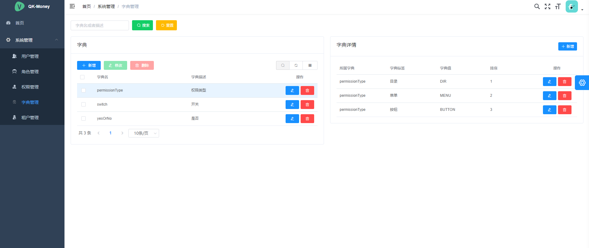
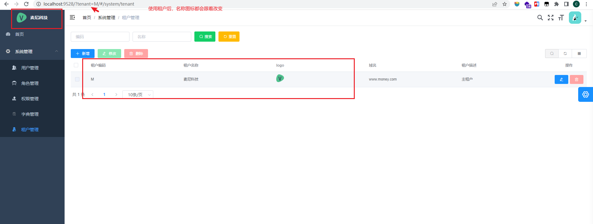

# 简介

​	`QK-MONEY`是一个基于Spring Boot 2.6、Spring Security、MybatisPlus 并提供如实现RBAC模型、基于JWT的权限认证解决方案、多租户等可拆卸模块化功能组件的**单体**后台框架。

- 使用JDK8语法和较新的技术栈，注重代码规范。
- 自由拆卸组装功能，不强依赖Redis。
- 尽可能"低水平"、低耦合高内聚。
- 开箱即用，客制化配置。

# 版本依赖

| 依赖         | 版本   |
| ------------ | ------ |
| JDK          | 1.8    |
| Maven        | 3.8.1  |
| Spring Boot  | 2.6.10 |
| Mybatis-plus | 3.5.2  |
| JJWT         | 0.11.2 |
| Hutool       | 5.8.4  |
| Jackson      | 2.12.4 |
| Spring Doc   | 1.5.11 |
| Qiniu        | 7.7.0  |
| XXL-JOB      | 2.3.1  |

- 本项目的模块版本声明都在根目录下的`POM.xml`，称为**主POM**
- 第三方依赖版本声明都在`qk-money-parent`包下的`POM.xml`，称为**清单POM**

# 功能清单

- [x] 通用web功能（全局响应、全局异常处理、访问日志）
- [x] 基于RBAC模型和JWT的权限认证解决方案
    - [x] 与前端配套的系统管理（用户管理、角色管理、权限管理、字典管理、租户管理）
- [x] 多租户（基于表字段）
- [x] 对象存储OSS
    - [x] 本地
    - [x] 七牛云
- [x] 缓存模块
    - [x] Hutool Cache
    - [ ] Caffeine
    - [x] Redis（支持Spring Cache）
- [x] 发送邮件
- [x] 定时任务（XXL-JOB）
- [x] 国际化（多语言、多时区）
- [x] 接口文档（OpenAPI3）
- [x] 代码生成器（CRUD）
- [x] 日志（logback），链路追踪
    - [x] 日志本地化
    - [x] MDC
- [x] ~~系统监控（Spring Boot Admin）~~

# 工程结构

| 模块                                                         | 描述                                                         |
| ------------------------------------------------------------ | ------------------------------------------------------------ |
| `qk-money-parent`[📜](./doc/qk-money-parent.md)               | 👉**父模块：BOM依赖版本清单**。建议其他模块不写具体版本号，新增依赖先在这声明版本。 |
| `qk-money-app`                                               | 👉**应用模块：主要开发的模块**                                |
| `qk-money-app`/`money-app-api`                               | *应用api模块：*放常量枚举、异常、Entity、DTO、VO等。         |
| `qk-money-app`/`money-app-biz`                               | *应用业务模块：*Controller、Service、Mapper等。              |
| `qk-money-app`/`money-app-system`                            | *应用系统模块：*提供和前端配套的基于RBAC模型和JWT的权限认证、数据字典等系统管理功能，也是安全模块的实现，biz模块默认会引入。 |
| `qk-money-common`                                            | 👉**通用模块：各种方便易用的功能包**                          |
| ~~`qk-money-common`/`money-common-core`~~                    | ~~（整合进common-web）通用核心模块：核心的常量枚举、通用异常和工具类（工具类能用[Hutool](https://www.hutool.cn/docs/#/)就不要重复造轮子）等。~~ |
| `qk-money-common`/`money-common-web`[📜](./doc/money-common-web.md) | *通用web模块：* **建议至少引入的模块**。<br />提供默认全局的响应返回、异常处理、请求日志切面、日志链路追踪、多语言、多时区等功能，减少项目的基础构建。 |
| `qk-money-common`/`money-common-mybatis`[📃](./doc/money-common-mybatis.md) | *Mybatis模块：*使用的是`Mybatis-Plus`，默认已配置分页插件、审计字段默认值填充（需继承`BaseEntity`）和**代码生成器**。 |
| `qk-money-common/money-common-cache`                         | *缓存模块：*提供本地缓存和集中式缓存`Redis`。                |
| `qk-money-common/money-common-mail`[📃](./doc/money-common-mail.md) | *邮件模块：*提供邮件发送功能。                               |
| `qk-money-common/money-common-schedule`[📃](./doc/money-common-schedule.md) | *定时任务模块：*提供集成XXL-JOB定时任务。                    |
| `qk-money-common`/`money-common-oss`[📃](./doc/money-common-oss.md) | *OSS对象存储模块：*提供本地文件OSS和七牛云OSS。              |
| `qk-money-common/money-common-swagger`[📃](./doc/money-common-swagger.md) | *接口文档模块：*提供Swagger接口集成（Open API 3）。          |
| `qk-money-security`[📃](./doc/qk-money-security.md)           | 👉**安全模块**：使用Spring Security框架封装，提供基于RBAC模型和JWT认证授权能力。 |
| `qk-money-tenant`[📃](./doc/qk-money-tenant.md)               | 👉**多租户模块：**基于`Mybatis Plus`多租户插件实现多租户功能。 |
| `xxl-job-admin`                                              | 👉**XXL-JOB调度中心**：[官方文档](https://www.xuxueli.com/xxl-job)，简单使用看定时任务模块文档即可。 |

> 点击📃查看对应模块使用文档，📜开发前建议先看。

# 快速使用手册

## 开发模块`qk-money-app`

二次开发的主要开发模块。

```
qk-money
├── qk-money-app -- 开发模块
    ├── money-app-api -- api模块，常量枚举、异常、Entity、DTO、VO等
    ├── money-app-biz -- 业务模块（引入api和system），编写Controller、Service、Mapper，配置也都在这个工程下的resource
    └── money-app-system -- 权限管理系统，开箱即用
```

## 启动步骤

1. 初始化数据库 `qk_money.sql`
2. 修改数据库连接池配置 `application-dev.yml`
3. 启动

> 此为最小依赖启动，仅仅依靠该工程和一个数据库，但是功能是齐全的。如果要使用一些其他依赖第三方组件的功能（如Redis、七牛云、定时任务XXL-JOB)，可在工程结构介绍里找到对应的功能模块，查看对应的使用文档。

## 开发步骤

1. **创建相关表**

    

    > 高亮字段是建议的必要字段，和`BaseEntity` 实体类对应，当然使用代码生成器的时候可以选择不继承。

2. **生成CRUD代码** `qk-money-common/money-common-mybatis/src/main/java/com/money/mb/MybatisPlusGenerator.java`，生成代码结构如下



> 生成的CRUD虽然能直接启动使用，但是它不包含业务逻辑，比如查询只有分页条件没有具体业务条件，名字不能重复等，这些生成后需要去补齐。生成的CRUD除了少写一些代码，更多的是给出一套开发的风格与规范，希望开发人员以统一的风格书写这些常用的操作。

3. **自行补充业务代码**

# 系统截图

 









# 配置总览

**客制化配置：**`qk-money-app/money-app-biz/resources/application-money.yml`

~~~yml
spring:
  config:
    # 引入对象存储的配置
    import: oss.properties  
money:
  web:
    # 全局响应处理器
    response-handler: true
    # 全局异常处理器
    exception-handler: true
    # 全局请求日志切面
    web-log-aspect: true
    # 多语言
    i18n:
      enabled: true
      support:
        - en
    # 多时区
    timezone:
      default-time-zone: GMT+08:00
  # 多租户
  tenant:
    # 开关
    enabled: true
    # 请求头
    header: Y-tenant
    # 默认租户id
    default-tenant-id: "0"
    # 忽略的表
    ignore-table:
      - sys_tenant
      - sys_dict
      - sys_dict_detail
  # 缓存
  cache:
    # 本地缓存
    local:
      # 提供者 hutool（默认）、caffeine
      provider: hutool
      # 过期时间：ms，0代表永不过期
      ttl: 86400000
      # hutool-cache参数
      hutool:
        # 失效策略：LRU（默认）、LFU、FIFO、TIMED、WEAK
        strategy: LRU
        # 容量
        capacity: 102400
    # redis 缓存
    redis:
      # 开关，默认关闭
      enabled: false
      # 过期时间：ms，主要用于@Cacheable相关注解的过期时间
      ttl: 86400000
  # 安全
  security:
    # token配置
    token:
      # token请求头名称
      header: Authorization
      # 令牌类型：完整token："{tokenType} {accessToken}"
      token-type: Bearer
      # 密钥
      secret: money
      # access token过期时间 ms，默认8小时
      ttl: 28800000
      # refresh token过期时间 ms，默认30天
      refresh-ttl: 2592000000
      # 策略：jwt（自动过期，默认）、redis
      strategy: jwt
      # 缓存键名
      cache-key: "security:token:"
    # 忽略的url
    ignore:
      get:
        - /tenants/byCode
        - /auth/refreshToken
      post:
        - /auth/login
        - /auth/logout
      pattern:
        - /error/**
        - /actuator/**
        - /swagger**/**
        - /webjars/**
        - /v3/**
        - /assets/**
        - /test/**
  # 邮件服务
  mail:
    host: smtp.shahow.top # 邮箱服务器
    username: qk-money@money.shahow.top # 账号
    password: Vv123456#
    properties:
      mail:
        smtp:
          auth: true
          starttls: # 使用SSL安全协议，必须配置如下
            enable: true
            required: true
    port: 465  # 端口
    protocol: smtps # 协议
    default-encoding: utf-8
    fromAlias: 麦尼 # 发件人别名
~~~

**OSS配置：**`qk-money-app/money-app-biz/resources/oss.properties`

~~~properties
# ================================= 本地
# 目标空间
local.bucket = F:/qk-money/
# 资源处理器
local.resource-handler = /assets/**
# ================================= 七牛云
# 访问密钥
qiniu.access-key =
# 秘密密钥
qiniu.secret-key =
# 是否使用https
qiniu.use-https = false
# 访问域名
qiniu.domain = r3xou9o36.hn-bkt.clouddn.com
# 目标空间
qiniu.bucket = qk-money
# 区域
qiniu.region = huanan
# 令牌过期时间
qiniu.token-expire = 3600
# 上传策略 https://developer.qiniu.com/kodo/1206/put-policy
qiniu.policy.returnBody = {\"key\":\"$(key)\",\"hash\":\"$(etag)\",\"fname\":\"$(x:fname)\",\"age\":\"$(x:age)\"}
~~~

**日志配置：**`qk-money-app/money-app-biz/resources/logback-spring.xml`

~~~xml
<?xml version="1.0" encoding="UTF-8"?>
<configuration>
    <!-- 引入Spring上下文配置属性 -->
    <springProperty scope="context" name="app_name" source="spring.application.name" defaultValue="app"/>
    <!-- 设置变量 -->
    <include resource="org/springframework/boot/logging/logback/defaults.xml" />
    <property name="FILE_LOG_PATTERN" value="%X{requestId}|%X{userId}> %d{HH:mm:ss.SSS} %-5level --- [%thread] %logger{36} : %msg%n"/>
    <property name="ACCESS_LOG_PATTERN" value="%X{requestId}|%X{userId}> %d{HH:mm:ss.SSS} %-5level- [%thread] %logger{0} : %msg%n"/>
    <property name="LOG_PATH" value="log"/>
    
    <appender name="STDOUT" class="ch.qos.logback.core.ConsoleAppender">
        <encoder>
            <pattern>${CONSOLE_LOG_PATTERN}</pattern>
        </encoder>
    </appender>
    <!-- 访问日志 -->
    <appender name="ACCESS_LOG" class="ch.qos.logback.core.rolling.RollingFileAppender">
        <rollingPolicy class="ch.qos.logback.core.rolling.TimeBasedRollingPolicy">
            <!-- 日志名格式 -->
            <fileNamePattern>${LOG_PATH}/%d{yyyy-MM-dd}/access.log</fileNamePattern>
            <!-- 日志保留一周 -->
            <maxHistory>7</maxHistory>
            <!-- 且所有日志大小总和不能超过5GB -->
            <totalSizeCap>5GB</totalSizeCap>
        </rollingPolicy>
        <encoder>
            <pattern>${ACCESS_LOG_PATTERN}</pattern>
        </encoder>
    </appender>
    <!-- INFO级别及以上日志 -->
    <appender name="FILE_INFO" class="ch.qos.logback.core.rolling.RollingFileAppender">
        <file>${LOG_PATH}/service.log</file>
        <filter class="ch.qos.logback.classic.filter.LevelFilter">
            <level>INFO</level>
            <onMatch>ACCEPT</onMatch>
            <onMismatch>ACCEPT</onMismatch>
        </filter>
        <rollingPolicy class="ch.qos.logback.core.rolling.TimeBasedRollingPolicy">
            <!-- 日志名格式 -->
            <fileNamePattern>${LOG_PATH}/%d{yyyy-MM-dd}/info.log</fileNamePattern>
            <!-- 日志保留一个月 -->
            <maxHistory>30</maxHistory>
            <!-- 且所有日志大小总和不能超过9GB -->
            <totalSizeCap>9GB</totalSizeCap>
        </rollingPolicy>
        <encoder>
            <pattern>${FILE_LOG_PATTERN}</pattern>
        </encoder>
    </appender>
    <!-- ERROR级别日志 -->
    <appender name="FILE_ERROR" class="ch.qos.logback.core.rolling.RollingFileAppender">
        <filter class="ch.qos.logback.classic.filter.ThresholdFilter">
            <level>ERROR</level>
        </filter>
        <rollingPolicy class="ch.qos.logback.core.rolling.TimeBasedRollingPolicy">
            <!-- 日志名格式 -->
            <fileNamePattern>${LOG_PATH}/%d{yyyy-MM-dd}/error.log</fileNamePattern>
            <!-- 日志保留一个月 -->
            <maxHistory>30</maxHistory>
            <!-- 且所有日志大小总和不能超过9GB -->
            <totalSizeCap>9GB</totalSizeCap>
        </rollingPolicy>
        <encoder>
            <pattern>${FILE_LOG_PATTERN}</pattern>
        </encoder>
    </appender>

    <logger name="com.money.common.log.DefaultWebLogAspect" level="info" additivity="false">
        <appender-ref ref="ACCESS_LOG" />
    </logger>

    <root level="info">
        <appender-ref ref="STDOUT" />
        <appender-ref ref="FILE_INFO" />
        <appender-ref ref="FILE_ERROR" />
    </root>
</configuration>
~~~

# 项目使用

[麦尼收银系统](https://github.com/ycf1998/money-pos)
