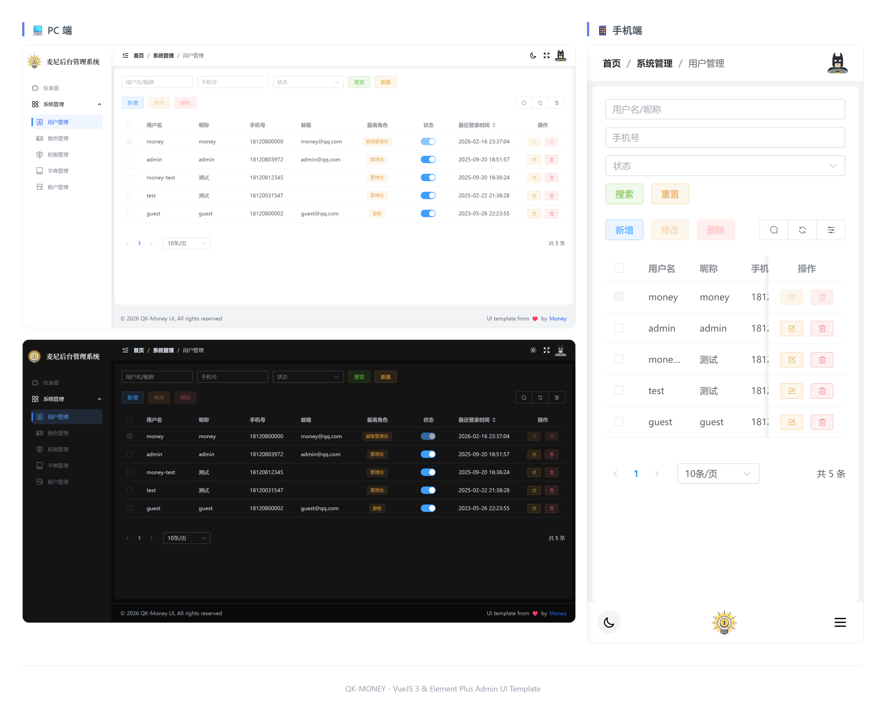

<h1 align="center">🚀 QK-MONEY</h1>

<p align="center">
  <strong>开箱即用的后台管理系统 · 前后端分离 · 快速开发框架</strong>
</p>

<p align="center">
  
  
  
  
  
  
</p>

<br>

<p align="center">
  
</p>


## ✨ 特性

| 分类 | 特性 |
|------|------|
| 🤖 **AI 辅助开发** | `/qk-dev` 命令，需求确认→设计文档→编码交付全流程 |
| 🔐 **认证授权** | JWT 双 Token + RBAC 模型，声明式鉴权 |
| 📦 **通用 Web** | 响应自动包装、异常统一处理、日志链路追踪 |
| 🏢 **多租户** | 表字段隔离，拦截器自动注入，开关控制 |
| 📁 **对象存储** | 统一接口，本地 / 七牛云随意切换 |
| 💾 **缓存** | Hutool 本地缓存 + Redis，集成 Spring Cache |
| 📧 **邮件** | 开箱即用 |
| ⏰ **定时任务** | XXL-JOB 分布式调度 |
| 📖 **接口文档** | OpenAPI 3 自动生成 |
| 🌍 **国际化** | 多语言 + 多时区 |
| 🎨 **Element Plus** | 自动按需导入，配套暗色模式 |
| ⚡ **Vite** | 极速 HMR，毫秒级热更新 |
| 💨 **TailwindCSS** | 原子化 CSS，灵活定制 |
| 🗂️ **Pinia** | 轻量级状态管理 |
| 🔒 **权限控制** | 路由级 + 按钮级 |
| 🔌 **Mock 数据** | 纯前端开发，零依赖后端 |

## 📦 环境依赖

| 依赖 | 版本 |
|------|------|
| JDK | 17+ |
| Maven | 3.8+ |
| Node | 18+ |

## 🏗️ 工程结构

| 模块 | 描述 |
|------|------|
| **`qk-money-parent`**[📜](./doc/backend/qk-money-parent.md) | 👉 **父模块：BOM（依赖版本清单）**<br />统一管理第三方依赖版本。 |
| **`qk-money-app`** | 👉 **应用模块：主要开发的模块** |
| `money-app-api` | 应用 API 模块：常量枚举、异常、Entity、DTO、VO 等。 |
| `money-app-biz` | 应用业务模块：Controller、Service、Mapper 等，启动类所在。 |
| `money-app-system` | 系统管理模块：预设的权限管理系统，可单独拆卸。 |
| **`qk-money-common`** | 👉 **通用模块：各种方便易用的功能包** |
| `money-common-web`[📜](./doc/backend/money-common-web.md) | 通用 Web 模块：全局响应处理、异常处理、日志链路追踪等。 |
| `money-common-mybatis`[📃](./doc/backend/money-common-mybatis.md) | MyBatis 模块：分页插件、审计字段填充、代码生成器。 |
| `money-common-cache`[📃](./doc/backend/money-common-cache.md) | 缓存模块：本地缓存和 Redis 缓存。 |
| `money-common-mail`[📃](./doc/backend/money-common-mail.md) | 邮件模块：邮件发送功能。 |
| `money-common-schedule`[📃](./doc/backend/money-common-schedule.md) | 定时任务模块：集成 XXL-JOB。 |
| `money-common-oss`[📃](./doc/backend/money-common-oss.md) | OSS 模块：本地存储和七牛云存储。 |
| `money-common-swagger`[📃](./doc/backend/money-common-swagger.md) | 接口文档模块：集成 Swagger（OpenAPI 3）。 |
| **`qk-money-security`**[📃](./doc/backend/qk-money-security.md) | 👉 **安全模块**：基于 Spring Security 的认证授权功能。 |
| **`qk-money-tenant`**[📃](./doc/backend/qk-money-tenant.md) | 👉 **多租户模块**：基于 MyBatis-Plus 的多租户支持。 |
| **`qk-money-ui`**[📃](./doc/frontend/) | 👉 **前端模块：Vue 3 + Vite + Element Plus 后台管理界面** |

> 📜 建议开发前先看 &emsp; 📃 按需查阅


## 🚀 快速开始

### 1. 克隆项目

```bash
git clone https://github.com/ycf1998/qk-money
cd qk-money
```

### 2. 初始化数据库

```bash
mysql -u root -p < qk_money.sql
```

> **MySQL 8 以下版本**：将脚本中的 `utf8mb4` 替换为 `utf8`，`utf8mb4_general_ci` 替换为 `utf8_general_ci`。

### 3. 配置数据库连接

编辑 `qk-money/qk-money-app/money-app-biz/src/main/resources/application-dev.yml`：

```yaml
spring:
  datasource:
    url: jdbc:mysql://127.0.0.1:3306/qk_money?useUnicode=true&characterEncoding=utf-8&serverTimezone=GMT%2B8
    username: root
    password: your_password
```

### 4. 启动后端

运行 `qk-money-app/money-app-biz` 模块下的 [`QkMoneyApplication`](./qk-money/qk-money-app/money-app-biz/src/main/java/com/money/QkMoneyApplication.java) 启动项目。

启动后访问：
- 接口文档：http://localhost:9000/qk-money/swagger-ui.html
- Swagger JSON：http://localhost:9000/qk-money/v3/api-docs

### 5. 启动前端

```bash
cd qk-money-ui
npm install
npm run dev
# → http://localhost:1520
```

### 前端独立开发（Mock 模式）

无需启动后端，修改 `qk-money-ui/.env.development`：

```properties
# 填写该值开启纯前端模式，所有请求不会真实触发，使用 mock.js 里的数据。可选值：alert/log
VITE_ONLY_UI=log
VITE_TITLE=麦尼后台管理系统
VITE_BASE_URL=http://localhost:9000/qk-money
```

开启后所有请求不会真实触发，使用 mock 数据响应。


## 🛠️ 二次开发

建表 → 代码生成 → 补充业务，三步完成新模块开发。

> 💡 **AI 辅助**：使用 Claude Code 的 `/qk-dev` 命令，AI 引导完成需求确认 → 设计文档 → 编码交付的全流程。

### 1. 建表

```sql
CREATE TABLE `demo` (
  `id` bigint UNSIGNED NOT NULL,
  `name` varchar(255) NOT NULL COMMENT '名称',
  `create_by` varchar(32) NOT NULL,
  `create_time` datetime NOT NULL DEFAULT CURRENT_TIMESTAMP,
  `update_by` varchar(32) NOT NULL,
  `update_time` datetime NOT NULL,
  `tenant_id` bigint UNSIGNED NOT NULL DEFAULT 0 COMMENT '租户 id',
  PRIMARY KEY (`id`)
) ENGINE = InnoDB CHARACTER SET = utf8mb4 COLLATE = utf8mb4_0900_ai_ci;
```

- **必选字段**：`id`、`create_by`、`create_time`、`update_by`、`update_time`（实体类继承 `BaseEntity` 后自动填充）
- **可选字段**：`tenant_id`（需要多租户隔离时添加）

### 2. 运行代码生成器

运行 `qk-money-common/money-common-mybatis` 模块下的 [`MybatisPlusGenerator`](./qk-money/qk-money-common/money-common-mybatis/src/main/java/com/money/mb/MybatisPlusGenerator.java)，修改配置后执行 main 函数生成 CRUD 代码。

### 3. 补充业务逻辑

根据生成的代码结构，在 `money-app-biz` 模块中调整并补充业务逻辑。


## 🖼️ 系统截图

<p align="center">
  
  
  
  
  
  
</p>

## ⚙️ 系统配置

所有客制化配置集中在 [`application-money.yml`](./qk-money/qk-money-app/money-app-biz/src/main/resources/application-money.yml)，涵盖 Web 行为、多租户、缓存、安全、邮件、对象存储等。

## 📝 使用登记

- [麦尼收银系统](https://github.com/ycf1998/money-pos)

