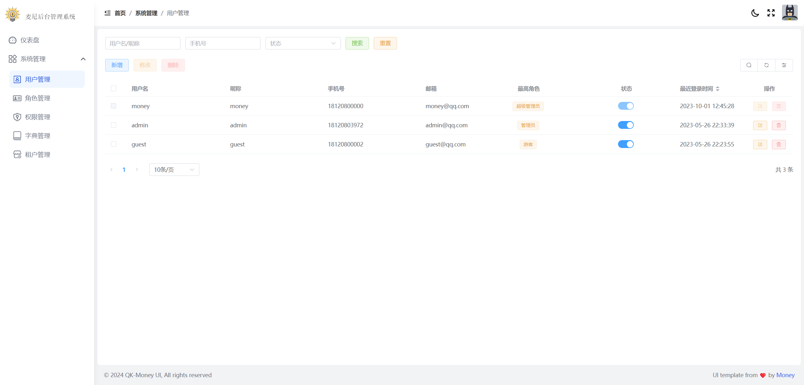
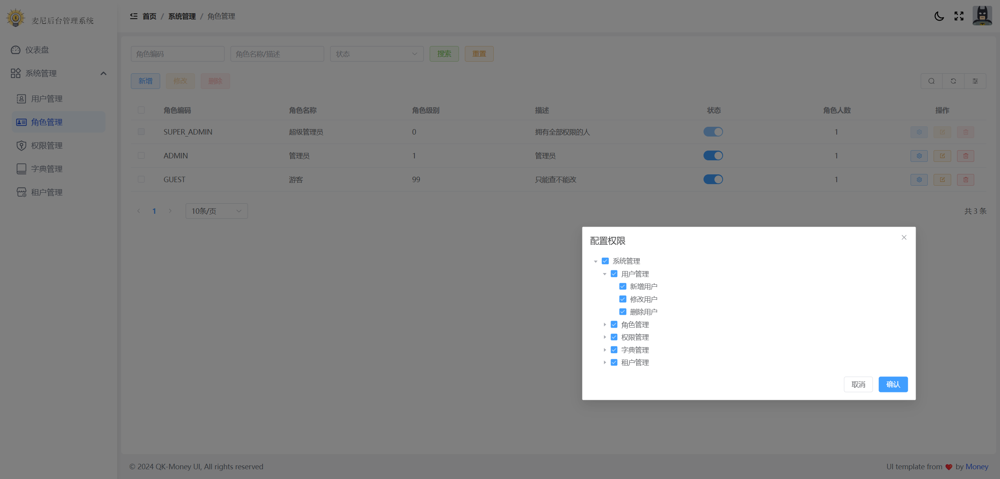
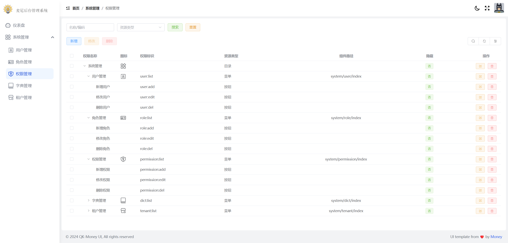
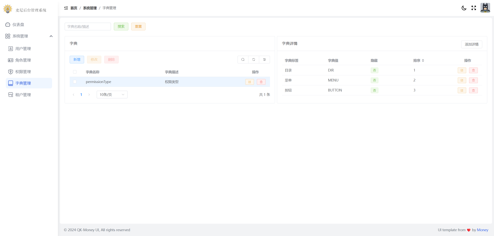
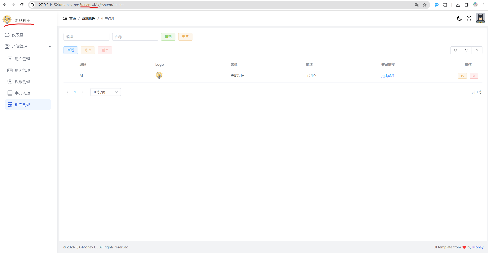
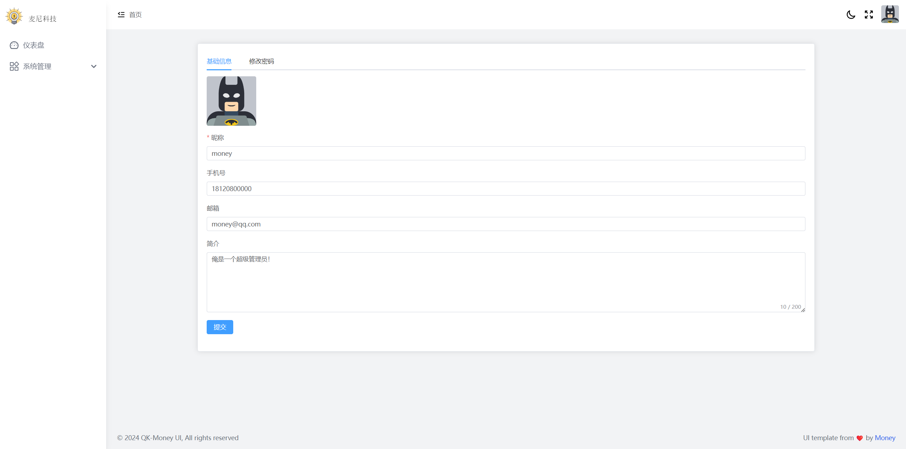

<h2 align="center">🎉 Qk-MONEY 后台快速开发框架</h2>

<p align="center">
  
  
  
  
</p>

<p align="center">Money - 基于 Spring Boot 2.7、Spring Security、MyBatis-Plus 的后台快速开发框架</p>

## ✨ 特性

- **主流技术栈**：基于 Spring Boot 2.7、Spring Security、MyBatis-Plus 等主流技术构建，代码规范，风格干净。
- **开箱即用**：封装全局响应、异常处理、日志链路等通用 Web 能力，专注核心业务开发。
- **灵活扩展**：模块独立解耦，支持按需选用和自定义扩展。
- **前后端分离**：面向 API 接口开发，前端配套代码：[Qk-MONEY UI](https://github.com/ycf1998/qk-money-ui)。

## 📦 版本依赖

| 依赖         | 版本     |
| ------------ | -------- |
| JDK          | 1.8+     |
| Maven        | 3.8.1    |
| Spring Boot  | 2.7.18   |
| MyBatis-Plus | 3.5.7    |
| JJWT         | 0.11.5   |
| Hutool       | 5.8.34   |
| Jackson      | 2.13.5   |
| Spring Doc   | 1.8.0    |
| Qiniu        | 7.13.1   |
| XXL-JOB      | 2.3.1    |

- **主 POM**：根目录下的 `pom.xml`，声明模块版本。
- **清单 POM**：`qk-money-parent` 包下的 `pom.xml`，声明第三方依赖版本。

## 🛠️ 功能清单

| 功能模块         | 描述                                                         |
| ---------------- | ------------------------------------------------------------ |
| **通用 Web 功能** | 全局响应处理、全局异常处理、日志链路追踪。                   |
| **权限认证**     | 基于 JWT 和 RBAC 模型的认证授权解决方案。                    |
| **多租户**       | 基于表字段的多租户支持。                                     |
| **对象存储 OSS** | 支持本地存储和七牛云存储。                                   |
| **缓存模块**     | 支持 Hutool Cache、Redis（集成 Spring Cache）。              |
| **邮件发送**     | 提供邮件发送功能。                                           |
| **定时任务**     | 集成 XXL-JOB，支持分布式定时任务。                           |
| **国际化**       | 支持多语言、多时区。                                         |
| **接口文档**     | 集成 OpenAPI 3，自动生成接口文档。                           |
| **代码生成器**   | 提供 CRUD 代码生成功能。                                     |
| **日志管理**     | 使用 Logback 实现日志本地化。                                |

## 🏗️ 工程结构

| 模块                                                          | 描述                                                         |
|-------------------------------------------------------------| ------------------------------------------------------------ |
| **`qk-money-parent`**[📜](./doc/qk-money-parent.md)         | 👉 **父模块：BOM（依赖版本清单）**<br />统一管理第三方依赖版本。 |
| **`qk-money-app`**                                          | 👉 **应用模块：主要开发的模块**                               |
| `money-app-api`                                             | 应用 API 模块：常量枚举、异常、Entity、DTO、VO 等。          |
| `money-app-biz`                                             | 应用业务模块：Controller、Service、Mapper 等，启动类所在。   |
| `money-app-system`                                          | 系统管理模块：预设的权限管理系统，可单独拆卸。               |
| **`qk-money-common`**                                       | 👉 **通用模块：各种方便易用的功能包**                         |
| `money-common-web`[📜](./doc/money-common-web.md)           | 通用 Web 模块：全局响应处理、异常处理、日志链路追踪等。      |
| `money-common-mybatis`[📃](./doc/money-common-mybatis.md)   | MyBatis 模块：分页插件、审计字段填充、代码生成器。           |
| `money-common-cache`[📃](./doc/money-common-cache.md)       | 缓存模块：本地缓存和 Redis 缓存。                            |
| `money-common-mail`[📃](./doc/money-common-mail.md)         | 邮件模块：邮件发送功能。                                     |
| `money-common-schedule`[📃](./doc/money-common-schedule.md) | 定时任务模块：集成 XXL-JOB。                                 |
| `money-common-oss`[📃](./doc/money-common-oss.md)           | OSS 模块：本地存储和七牛云存储。                             |
| `money-common-swagger`[📃](./doc/money-common-swagger.md)   | 接口文档模块：集成 Swagger（OpenAPI 3）。                    |
| **`qk-money-security`**[📃](./doc/qk-money-security.md)     | 👉 **安全模块**：基于 Spring Security 的认证授权功能。        |
| **`qk-money-tenant`**[📃](./doc/qk-money-tenant.md)         | 👉 **多租户模块**：基于 MyBatis-Plus 的多租户支持。           |
| **`xxl-job-admin`**                                         | 👉 **XXL-JOB 调度中心**：分布式任务调度。                     |

> 📃 查看对应模块使用文档，📜 开发前建议先看。

## 🚀 本地启动指南

### 1. 克隆项目

```bash
git clone https://github.com/ycf1998/qk-money
cd qk-money
```

### 2. 创建 & 初始化数据库

使用 MySQL 8 以下版本时，替换脚本中的 `utf8mb4` 为 `utf8`，`utf8mb4_general_ci` 为 `utf8_general_ci`。

```bash
mysql -u root -p < qk_money.sql
```

或使用图形化工具（如 Navicat）导入 `qk_money.sql` 文件。

### 3. 修改数据库连接信息

编辑 `qk-money-app/money-app-biz/src/main/resources/application-dev.yml` 文件，配置数据库连接：

```yaml
spring:
  datasource:
    url: jdbc:mysql://127.0.0.1:3306/qk_money?useUnicode=true&characterEncoding=utf-8&serverTimezone=GMT%2b8
    username: root
    password: your_password
```

### 4. 启动项目

运行 `qk-money-app/money-app-biz` 模块下的 [`QkMoneyApplication`](./qk-money-app/money-app-biz/src/main/java/com/money/QkMoneyApplication.java) 启动项目。

启动成功后访问：
- 接口文档：`http://localhost:9000/qk-money/swagger-ui.html`
- Swagger JSON：`http://localhost:9000/qk-money/v3/api-docs`

## 🛠️ 二次开发手册

### 1. 建表

```sql
CREATE TABLE `demo` (
  `id` bigint UNSIGNED NOT NULL,
  `name` varchar(255) NOT NULL COMMENT '名称',
  `create_by` varchar(32) NOT NULL,
  `create_time` datetime NOT NULL DEFAULT CURRENT_TIMESTAMP,
  `update_by` varchar(32) NOT NULL,
  `update_time` datetime NOT NULL,
  `tenant_id` bigint UNSIGNED NOT NULL DEFAULT 0 COMMENT '租户 id',
  PRIMARY KEY (`id`)
) ENGINE = InnoDB CHARACTER SET = utf8mb4 COLLATE = utf8mb4_0900_ai_ci;
```

- **基础字段**：`id`、`create_by`、`create_time`、`update_by`、`update_time`（搭配继承 `BaseEntity`）
- **可选字段**：`tenant_id`（租户 ID，需要多租户隔离时添加）

### 2. 运行代码生成器

运行 `money-common-mybatis` 模块下的 [`MybatisPlusGenerator`](./qk-money-common/money-common-mybatis/src/main/java/com/money/mb/MybatisPlusGenerator.java)，修改配置后执行 main 函数生成 CRUD 代码。

### 3. 调整并补充业务代码

根据生成的代码结构，在 `money-app-biz` 模块中调整并补充业务逻辑。

## 🖼️ 系统截图

| 功能模块       | 截图 |
| -------------- | --- |
| **用户管理**   |  |
| **角色管理**   |  |
| **权限管理**   |  |
| **字典管理**   |  |
| **租户管理**   |  |
| **个人信息管理** |  |

## ⚙️ 配置总览

### 客制化配置：`application-money.yml`

```yaml
money:
  web:
    response-handler: true      # 全局响应处理器
    exception-handler: true     # 全局异常处理器
    web-log-aspect:
      enabled: true
      mode: ignore_get_result   # all / simple / ignore_get_result
    i18n:
      enabled: true
      support:
        - en
    timezone:
      enabled: true
      default-time-zone: GMT+08:00
  
  tenant:
    enabled: false
    header: Y-tenant
    default-tenant-id: "0"
    ignore-table:
      - sys_tenant
      - sys_dict
  
  cache:
    local:
      provider: hutool          # hutool / caffeine
      hutool:
        strategy: LRU           # LRU / LFU / FIFO / TIMED / WEAK
        capacity: 102400
        ttl: 86400000           # 过期时间 (ms)
    redis:
      enabled: false
      ttl: 86400000
  
  security:
    token:
      header: Authorization
      token-type: Bearer
      secret: your-secret       # 生产环境请修改
      ttl: 28800000             # Access Token 过期时间 (ms)
      refresh-ttl: 2592000000   # Refresh Token 过期时间 (ms)
      strategy: jwt             # jwt / redis
    ignore:
      pattern:
        - /auth/login
        - /swagger**/**
  
  mail:
    host: smtp.qq.com
    username: your-email@qq.com
    password: your-auth-code
    port: 465
    protocol: smtps
    from-alias: 麦尼

  oss:
    local:
      bucket: F:/qk-money/
      resource-handler: /assets/**
    qiniu:
      access-key: your-access-key
      secret-key: your-secret-key
      domain: your-domain.com
      bucket: your-bucket
      region: huanan
      token-expire: 3600
```

## 📝 使用登记

- [麦尼收银系统](https://github.com/ycf1998/money-pos)

## 📄 License

MIT License
