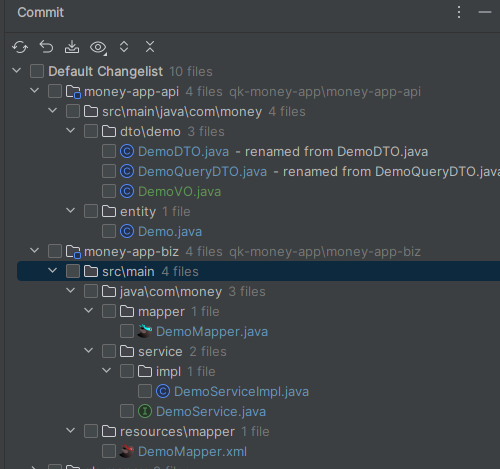

# 简介

QK-MONEY 是一个基于 Spring Boot 2.7、Spring Security、MyBatis-Plus 等实现的快速后台开发框架。

- 基于主流技术构建，注重代码规范，干净的代码风格
- 采用组件化思想，拆分功能模块，按需引入，开箱即用
- 采用前后端分离架构，面向 API 接口开发

# 版本依赖

| 依赖         | 版本      |
| ------------ |---------|
| JDK          | 1.8+    |
| Maven        | 3.8.1   |
| Spring Boot  | 2.7.12  |
| MyBatis-Plus | 3.5.3.1 |
| JJWT         | 0.11.5  |
| Hutool       | 5.8.20  |
| Jackson      | 2.13.5  |
| Spring Doc   | 1.7.0   |
| Qiniu        | 7.13.1  |
| XXL-JOB      | 2.3.1   |

- 本项目的模块版本声明都在根目录下的 `pom.xml`，称为 **主POM**
- 第三方依赖版本声明都在 `qk-money-parent` 包下的 `pom.xml`，称为 **清单POM**

# 功能清单

- [x] 通用 Web 功能（全局响应处理、全局异常处理、日志链路追踪）
- [x] 基于 JWT 认证和 RBAC 模型的权限认证解决方案
- [x] 多租户（基于表字段）
- [x] 对象存储 OSS
    - [x] 本地
    - [x] 七牛云
- [x] 缓存模块
    - [x] Hutool Cache
    - [ ] Caffeine
    - [x] Redis（支持 Spring Cache）
- [x] 发送邮件
- [x] 定时任务（XXL-JOB）
- [x] 国际化（多语言、多时区）
- [x] 接口文档（OpenAPI 3）
- [x] 代码生成器（CRUD）
- [x] 日志本地化（Logback）
- [x] ~~系统监控（Spring Boot Admin）~~

# 工程结构

| 模块                                                         | 描述                                                         |
| ------------------------------------------------------------ | ------------------------------------------------------------ |
| `qk-money-parent`[📜](./doc/qk-money-parent.md)               | 👉**父模块：BOM（依赖版本清单）**。<br />建议其他模块依赖不写具体版本号，第三方依赖版本均在此声明，统一管理。 |
| `qk-money-app`                                               | 👉**应用模块：主要开发的模块**                                |
| `qk-money-app`/`money-app-api`                               | 应用 API 模块：放常量枚举、异常、Entity、DTO、VO 等。        |
| `qk-money-app`/`money-app-biz`                               | 应用业务模块：Controller、Service、Mapper 等，启动类所在。   |
| `qk-money-app`/`money-app-system`                            | 系统管理模块：QK-MOENY 预设的一套权限管理系统，单独模块方便拆卸。 |
| `qk-money-common`                                            | 👉**通用模块：各种方便易用的功能包**                          |
| `qk-money-common`/`money-common-web`[📜](./doc/money-common-web.md) | 通用 Web 模块： Web 开发的核心模块。<br />提供默认的全局响应处理、异常处理、请求日志切面、日志链路追踪、多语言、多时区等功能，减少 Web 项目的基础构建。 |
| `qk-money-common`/`money-common-mybatis`[📃](./doc/money-common-mybatis.md) | MyBatis 模块：使用 MyBatis-Plus 增强库，默认配置分页插件、审计字段默认值填充（需继承 `BaseEntity`）和代码生成器。 |
| `qk-money-common/money-common-cache`                         | 缓存模块：提供本地缓存和集中式缓存 Redis。                   |
| `qk-money-common/money-common-mail`[📃](./doc/money-common-mail.md) | 邮件模块：提供邮件发送功能。                                 |
| `qk-money-common/money-common-schedule`[📃](./doc/money-common-schedule.md) | 定时任务模块：提供集成 XXL-JOB 定时任务。                    |
| `qk-money-common`/`money-common-oss`[📃](./doc/money-common-oss.md) | OSS 对象存储模块：提供本地文件存储和七牛云对象存储。         |
| `qk-money-common/money-common-swagger`[📃](./doc/money-common-swagger.md) | 接口文档模块：提供 Swagger 接口文档集成（OpenAPI 3）。       |
| `qk-money-security`[📃](./doc/qk-money-security.md)           | 👉**安全模块**：基于 Spring Security 框架封装，提供基于 Token 和 RBAC 模型的认证授权能力。 |
| `qk-money-tenant`[📃](./doc/qk-money-tenant.md)               | 👉**多租户模块**：使用 MyBatis-Plus 多租户插件实现的基于表字段的多租户功能。 |
| `xxl-job-admin`                                              | 👉**XXL-JOB 调度中心**：[官方文档](https://www.xuxueli.com/xxl-job)，简单使用看定时任务模块文档即可。 |

> 点击📃查看对应模块使用文档，📜开发前建议先看。

# 本地启动指南

1. 克隆项目

    ```bash
    git clone https://github.com/ycf1998/qk-money
    ```

2. 创建 & 初始化数据库

    - 命令行方式：`mysql -u root < qk_money.sql`
    - 图形化如 Navicat

    

3. 修改数据库连接信息 

    

4. 运行 qk-money-biz 下 QkMoneyApplication 的 Main 函数

# 二次开发手册

1. 建表

    ```sql
    CREATE TABLE `qk-money`.`demo`  (
      `id` bigint UNSIGNED NOT NULL,
      `name` varchar(255) CHARACTER SET utf8mb4 COLLATE utf8mb4_0900_ai_ci NOT NULL COMMENT '名称',
      `create_by` varchar(32) CHARACTER SET utf8mb4 COLLATE utf8mb4_general_ci NOT NULL,
      `create_time` datetime NOT NULL DEFAULT CURRENT_TIMESTAMP,
      `update_by` varchar(32) CHARACTER SET utf8mb4 COLLATE utf8mb4_general_ci NOT NULL,
      `update_time` datetime NOT NULL,
      `tenant_id` bigint UNSIGNED NOT NULL DEFAULT 0 COMMENT '租户id',
      PRIMARY KEY (`id`) USING BTREE
    ) ENGINE = InnoDB CHARACTER SET = utf8mb4 COLLATE = utf8mb4_0900_ai_ci ROW_FORMAT = DYNAMIC;
    ```

    基础字段：可搭配继承 BaseEntity 使用

    - id：主键
    - create_by：创建者
    - create_time：创建时间
    - update_by：更新者
    - update_time：创建时间

    可选字段：

    - tenant_id：租户 id

2. 运行 money-common-mybatis 下的代码生成器 MybatisPlusGenerator

    

3. 生成代码结构如下，调整并补充业务代码

    

# 系统截图


# 配置总览

**客制化配置：**qk-money-app/money-app-biz/resources/application-money.yml

~~~yml
spring:
  config:
    # 引入对象存储的配置
    import: oss.properties  
money:
  web:
    # 全局响应处理器
    response-handler: true
    # 全局异常处理器
    exception-handler: true
    # 全局请求日志切面
    web-log-aspect: true
    # 多语言
    i18n:
      enabled: true
      support:
        - en
    # 多时区
    timezone:
      default-time-zone: GMT+08:00
  # 多租户
  tenant:
    # 开关
    enabled: false
    # 请求头
    header: Y-tenant
    # 默认租户id
    default-tenant-id: "0"
    # 忽略的表
    ignore-table:
      - sys_tenant
      - sys_dict
      - sys_dict_detail
  # 缓存
  cache:
    # 本地缓存
    local:
      # 提供者 hutool（默认）、caffeine
      provider: hutool
      # 过期时间：ms，0代表永不过期
      ttl: 86400000
      # hutool-cache参数
      hutool:
        # 失效策略：LRU（默认）、LFU、FIFO、TIMED、WEAK
        strategy: LRU
        # 容量
        capacity: 102400
    # redis 缓存
    redis:
      # 开关，默认关闭
      enabled: false
      # 过期时间：ms，主要用于@Cacheable相关注解的过期时间
      ttl: 86400000
  # 安全
  security:
    # token配置
    token:
      # token请求头名称
      header: Authorization
      # 令牌类型：完整token："{tokenType} {accessToken}"
      token-type: Bearer
      # 密钥
      secret: money
      # access token过期时间 ms，默认8小时
      ttl: 28800000
      # refresh token过期时间 ms，默认30天
      refresh-ttl: 2592000000
      # 策略：jwt（自动过期，默认）、redis
      strategy: jwt
      # 缓存键名
      cache-key: "security:token:"
    # 忽略的url
    ignore:
      get:
        - /tenants/byCode
        - /auth/refreshToken
      post:
        - /auth/login
        - /auth/logout
      pattern:
        - /error/**
        - /actuator/**
        - /swagger**/**
        - /webjars/**
        - /v3/**
        - /assets/**
        - /test/**
  # 邮件服务
  mail:
    host: smtp.shahow.top # 邮箱服务器
    username: qk-money@money.shahow.top # 账号
    password: Vv123456#
    properties:
      mail:
        smtp:
          auth: true
          starttls: # 使用SSL安全协议，必须配置如下
            enable: true
            required: true
    port: 465  # 端口
    protocol: smtps # 协议
    default-encoding: utf-8
    fromAlias: 麦尼 # 发件人别名
~~~

**OSS配置：**qk-money-app/money-app-biz/resources/oss.properties

~~~properties
# ================================= 本地
# 目标空间
local.bucket = F:/qk-money/
# 资源处理器
local.resource-handler = /assets/**
# ================================= 七牛云
# 访问密钥
qiniu.access-key =
# 秘密密钥
qiniu.secret-key =
# 是否使用https
qiniu.use-https = false
# 访问域名
qiniu.domain = r3xou9o36.hn-bkt.clouddn.com
# 目标空间
qiniu.bucket = qk-money
# 区域
qiniu.region = huanan
# 令牌过期时间
qiniu.token-expire = 3600
# 上传策略 https://developer.qiniu.com/kodo/1206/put-policy
qiniu.policy.returnBody = {\"key\":\"$(key)\",\"hash\":\"$(etag)\",\"fname\":\"$(x:fname)\",\"age\":\"$(x:age)\"}
~~~

**日志配置：**qk-money-app/money-app-biz/resources/logback-spring.xml

~~~xml
<?xml version="1.0" encoding="UTF-8"?>
<configuration>
    <!-- 引入Spring上下文配置属性 -->
    <springProperty scope="context" name="app_name" source="spring.application.name" defaultValue="app"/>
    <!-- 设置变量 -->
    <include resource="org/springframework/boot/logging/logback/defaults.xml" />
    <property name="FILE_LOG_PATTERN" value="%X{requestId}|%X{userId}> %d{HH:mm:ss.SSS} %-5level --- [%thread] %logger{36} : %msg%n"/>
    <property name="ACCESS_LOG_PATTERN" value="%X{requestId}|%X{userId}> %d{HH:mm:ss.SSS} %-5level- [%thread] %logger{0} : %msg%n"/>
    <property name="LOG_PATH" value="log"/>
    
    <appender name="STDOUT" class="ch.qos.logback.core.ConsoleAppender">
        <encoder>
            <pattern>${CONSOLE_LOG_PATTERN}</pattern>
        </encoder>
    </appender>
    <!-- 访问日志 -->
    <appender name="ACCESS_LOG" class="ch.qos.logback.core.rolling.RollingFileAppender">
        <rollingPolicy class="ch.qos.logback.core.rolling.TimeBasedRollingPolicy">
            <!-- 日志名格式 -->
            <fileNamePattern>${LOG_PATH}/%d{yyyy-MM-dd}/access.log</fileNamePattern>
            <!-- 日志保留一周 -->
            <maxHistory>7</maxHistory>
            <!-- 且所有日志大小总和不能超过5GB -->
            <totalSizeCap>5GB</totalSizeCap>
        </rollingPolicy>
        <encoder>
            <pattern>${ACCESS_LOG_PATTERN}</pattern>
        </encoder>
    </appender>
    <!-- INFO级别及以上日志 -->
    <appender name="FILE_INFO" class="ch.qos.logback.core.rolling.RollingFileAppender">
        <file>${LOG_PATH}/service.log</file>
        <filter class="ch.qos.logback.classic.filter.LevelFilter">
            <level>INFO</level>
            <onMatch>ACCEPT</onMatch>
            <onMismatch>ACCEPT</onMismatch>
        </filter>
        <rollingPolicy class="ch.qos.logback.core.rolling.TimeBasedRollingPolicy">
            <!-- 日志名格式 -->
            <fileNamePattern>${LOG_PATH}/%d{yyyy-MM-dd}/info.log</fileNamePattern>
            <!-- 日志保留一个月 -->
            <maxHistory>30</maxHistory>
            <!-- 且所有日志大小总和不能超过9GB -->
            <totalSizeCap>9GB</totalSizeCap>
        </rollingPolicy>
        <encoder>
            <pattern>${FILE_LOG_PATTERN}</pattern>
        </encoder>
    </appender>
    <!-- ERROR级别日志 -->
    <appender name="FILE_ERROR" class="ch.qos.logback.core.rolling.RollingFileAppender">
        <filter class="ch.qos.logback.classic.filter.ThresholdFilter">
            <level>ERROR</level>
        </filter>
        <rollingPolicy class="ch.qos.logback.core.rolling.TimeBasedRollingPolicy">
            <!-- 日志名格式 -->
            <fileNamePattern>${LOG_PATH}/%d{yyyy-MM-dd}/error.log</fileNamePattern>
            <!-- 日志保留一个月 -->
            <maxHistory>30</maxHistory>
            <!-- 且所有日志大小总和不能超过9GB -->
            <totalSizeCap>9GB</totalSizeCap>
        </rollingPolicy>
        <encoder>
            <pattern>${FILE_LOG_PATTERN}</pattern>
        </encoder>
    </appender>

    <logger name="com.money.common.log.DefaultWebLogAspect" level="info" additivity="false">
        <appender-ref ref="ACCESS_LOG" />
    </logger>

    <root level="info">
        <appender-ref ref="STDOUT" />
        <appender-ref ref="FILE_INFO" />
        <appender-ref ref="FILE_ERROR" />
    </root>
</configuration>
~~~

# 使用登记

[麦尼收银系统](https://github.com/ycf1998/money-pos)
