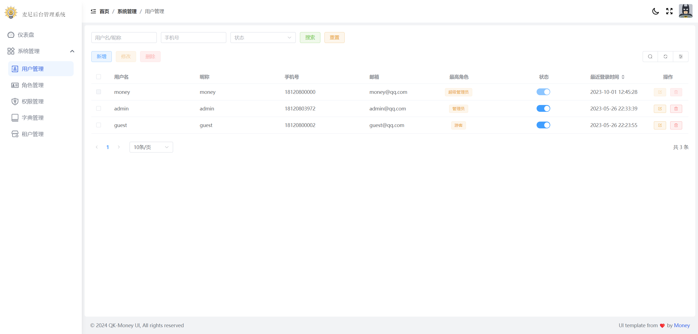

<h2 align="center">🎉 Qk-MONEY 后台快速开发框架</h2>

<p align="center">
  
  
  
  
</p>

<p align="center">Money - 基于 Spring Boot 2.7、Spring Security、MyBatis-Plus 的后台快速开发框架</p>


## ✨ 特性

- **主流技术栈**：基于 Spring Boot 2.7、Spring Security、MyBatis-Plus 等主流技术构建，代码规范，风格干净。
- **组件化设计**：采用组件化思想，功能模块按需引入，开箱即用。
- **前后端分离**：面向 API 接口开发，前端配套代码：[Qk-MONEY UI](https://github.com/ycf1998/qk-money-ui)。


## 📦 版本依赖

| 依赖         | 版本     |
| ------------ | -------- |
| JDK          | 1.8+     |
| Maven        | 3.8.1    |
| Spring Boot  | 2.7.18   |
| MyBatis-Plus | 3.5.7    |
| JJWT         | 0.11.5   |
| Hutool       | 5.8.34   |
| Jackson      | 2.13.5   |
| Spring Doc   | 1.8.0    |
| Qiniu        | 7.13.1   |
| XXL-JOB      | 2.3.1    |

- **主 POM**：根目录下的 `pom.xml`，声明模块版本。
- **清单 POM**：`qk-money-parent` 包下的 `pom.xml`，声明第三方依赖版本。


## 🛠️ 功能清单

| 功能模块         | 描述                                                         |
| ---------------- | ------------------------------------------------------------ |
| **通用 Web 功能** | 全局响应处理、全局异常处理、日志链路追踪。                   |
| **权限认证**     | 基于 JWT 和 RBAC 模型的认证授权解决方案。                    |
| **多租户**       | 基于表字段的多租户支持。                                     |
| **对象存储 OSS** | 支持本地存储和七牛云存储。                                   |
| **缓存模块**     | 支持 Hutool Cache、Redis（集成 Spring Cache）。              |
| **邮件发送**     | 提供邮件发送功能。                                           |
| **定时任务**     | 集成 XXL-JOB，支持分布式定时任务。                           |
| **国际化**       | 支持多语言、多时区。                                         |
| **接口文档**     | 集成 OpenAPI 3，自动生成接口文档。                           |
| **代码生成器**   | 提供 CRUD 代码生成功能。                                     |
| **日志管理**     | 使用 Logback 实现日志本地化。                                |


## 🏗️ 工程结构

| 模块                                                          | 描述                                                         |
|-------------------------------------------------------------| ------------------------------------------------------------ |
| **`qk-money-parent`**[📜](./doc/qk-money-parent.md)         | 👉 **父模块：BOM（依赖版本清单）**<br />统一管理第三方依赖版本。 |
| **`qk-money-app`**                                          | 👉 **应用模块：主要开发的模块**                               |
| `money-app-api`                                             | 应用 API 模块：常量枚举、异常、Entity、DTO、VO 等。          |
| `money-app-biz`                                             | 应用业务模块：Controller、Service、Mapper 等，启动类所在。   |
| `money-app-system`                                          | 系统管理模块：预设的权限管理系统，可单独拆卸。               |
| **`qk-money-common`**                                       | 👉 **通用模块：各种方便易用的功能包**                         |
| `money-common-web`[📜](./doc/money-common-web.md)           | 通用 Web 模块：全局响应处理、异常处理、日志链路追踪等。      |
| `money-common-mybatis`[📃](./doc/money-common-mybatis.md)   | MyBatis 模块：分页插件、审计字段填充、代码生成器。           |
| `money-common-cache`                                        | 缓存模块：本地缓存和 Redis 缓存。                            |
| `money-common-mail`[📃](./doc/money-common-mail.md)         | 邮件模块：邮件发送功能。                                     |
| `money-common-schedule`[📃](./doc/money-common-schedule.md) | 定时任务模块：集成 XXL-JOB。                                 |
| `money-common-oss`[📃](./doc/money-common-oss.md)           | OSS 模块：本地存储和七牛云存储。                             |
| `money-common-swagger`[📃](./doc/money-common-swagger.md)   | 接口文档模块：集成 Swagger（OpenAPI 3）。                    |
| **`qk-money-security`**[📃](./doc/qk-money-security.md)     | 👉 **安全模块**：基于 Spring Security 的认证授权功能。        |
| **`qk-money-tenant`**[📃](./doc/qk-money-tenant.md)         | 👉 **多租户模块**：基于 MyBatis-Plus 的多租户支持。           |
| **`xxl-job-admin`**                                         | 👉 **XXL-JOB 调度中心**：分布式任务调度。                     |

点击📃查看对应模块使用文档，📜开发前建议先看。


## 🚀 本地启动指南

1. **克隆项目**

   ```bash
   git clone https://github.com/ycf1998/qk-money
   ```

2. **创建 & 初始化数据库**

    - 使用 MySQL 8 以下版本时，替换脚本中的 `utf8mb4` 为 `utf8`，`utf8mb4_general_ci` 为 `utf8_general_ci`。
    - 命令行方式：`mysql -u root < qk_money.sql`
    - 图形化工具（如 Navicat）：

      

3. **修改数据库连接信息**

   编辑 `application-dev.yml` 文件，配置数据库连接信息：

   

4. **启动项目**

   运行 [`QkMoneyApplication`](./qk-money-app/money-app-biz/src/main/java/com/money/QkMoneyApplication.java) 启动项目。


## 🛠️ 二次开发手册

1. **建表**

   ```sql
   CREATE TABLE `qk-money`.`demo` (
     `id` bigint UNSIGNED NOT NULL,
     `name` varchar(255) NOT NULL COMMENT '名称',
     `create_by` varchar(32) NOT NULL,
     `create_time` datetime NOT NULL DEFAULT CURRENT_TIMESTAMP,
     `update_by` varchar(32) NOT NULL,
     `update_time` datetime NOT NULL,
     `tenant_id` bigint UNSIGNED NOT NULL DEFAULT 0 COMMENT '租户id',
     PRIMARY KEY (`id`) USING BTREE
   ) ENGINE = InnoDB CHARACTER SET = utf8mb4 COLLATE = utf8mb4_0900_ai_ci ROW_FORMAT = DYNAMIC;
   ```

    - **基础字段**：`id`、`create_by`、`create_time`、`update_by`、`update_time`。（搭配继承 `BaseEntity`）
    - **可选字段**：`tenant_id`（租户 ID）。

2. **运行代码生成器**

   运行 `money-common-mybatis` 模块下的 `MybatisPlusGenerator`：

   

3. **调整并补充业务代码**

   根据生成的代码结构，调整并补充业务逻辑：

   


## 🖼️ 系统截图

| 功能模块       | 截图                                                         |
|------------| ------------------------------------------------------------ |
| **用户管理**   |                           |
| **角色管理**   | .png)                        |
| **权限管理**   | .png)                      |
| **字典管理**   | .png)                      |
| **租户管理**   | .png)                      |
| **个人信息管理** | .png)                      |


## ⚙️ 配置总览
### **客制化配置：** `qk-money-app/money-app-biz/resources/application-money.yml`

```yml
money:
  web:
    # 全局响应处理器
    response-handler: true
    # 全局异常处理器
    exception-handler: true
    # 全局请求日志切面
    web-log-aspect:
      enabled: true
      mode: ignore_get_result
    # 多语言
    i18n:
      enabled: true
      support:
        - en
    # 多时区
    timezone:
      enabled: true
      default-time-zone: GMT+08:00
  # 多租户
  tenant:
    # 开关
    enabled: false
    # 请求头
    header: Y-tenant
    # 默认租户id
    default-tenant-id: "0"
    # 忽略的表
    ignore-table:
      - sys_tenant
      - sys_dict
      - sys_dict_detail
  # 缓存
  cache:
    # 本地缓存
    local:
      # 提供者 hutool（默认）、caffeine
      provider: hutool
      # hutool-cache参数
      hutool:
        # 失效策略：LRU（默认）、LFU、FIFO、TIMED、WEAK
        strategy: LRU
        # 容量
        capacity: 102400
        # 过期时间：ms，0代表永不过期
        ttl: 86400000
    # redis 缓存
    redis:
      # 开关，默认关闭
      enabled: false
      # 过期时间：ms，主要用于@Cacheable相关注解的过期时间
      ttl: 86400000
  # 安全
  security:
    # Token 配置
    token:
      # Token 请求头键名
      header: Authorization
      # 令牌类型：完整 Token："{tokenType} {accessToken}"
      token-type: Bearer
      # 密钥
      secret: money
      # Access Token 过期时间（ms），默认8小时
      ttl: 28800000
      # Refresh Token 过期时间（ms），默认30天
      refresh-ttl: 2592000000
      # 策略：jwt（自动过期，默认）、redis
      strategy: jwt
      # 缓存键名前缀
      cache-key: "security:token:"
    # 忽略的 URL
    ignore:
      get:
        - /tenants/byCode
        - /auth/refreshToken
      post:
        - /auth/login
        - /auth/logout
      pattern:
        - /error/**
        - /actuator/**
        - /swagger**/**
        - /webjars/**
        - /v3/**
        - /assets/**
        - /demo/**
  # 邮件服务
  mail:
    host: smtp.shahow.top # 邮箱服务器
    username: qk-money@money.shahow.top # 账号
    password: Vv123456#
    properties:
      mail:
        smtp:
          auth: true
          starttls: # 使用SSL安全协议，必须配置如下
            enable: true
            required: true
    port: 465  # 端口
    protocol: smtps # 协议
    default-encoding: utf-8
    fromAlias: 麦尼 # 发件人别名
```
### OSS 配置： `qk-money-app/money-app-biz/resources/oss.properties`

```properties
# ================================= 本地
# 目标空间
local.bucket = F:/qk-money/
# 资源处理器
local.resource-handler = /assets/**
# ================================= 七牛云
# 访问密钥
qiniu.access-key =
# 秘密密钥
qiniu.secret-key =
# 是否使用https
qiniu.use-https = false
# 访问域名
qiniu.domain = r3xou9o36.hn-bkt.clouddn.com
# 目标空间
qiniu.bucket = qk-money
# 区域
qiniu.region = huanan
# 令牌过期时间
qiniu.token-expire = 3600
# 上传策略 https://developer.qiniu.com/kodo/1206/put-policy
qiniu.policy.returnBody = {\"key\":\"$(key)\",\"hash\":\"$(etag)\",\"fname\":\"$(x:fname)\",\"age\":\"$(x:age)\"}
```

### 日志配置： `qk-money-app/money-app-biz/resources/logback.xml`

```xml
<?xml version="1.0" encoding="UTF-8"?>
<configuration>
    <!-- 引入Spring上下文配置属性 -->
    <springProperty scope="context" name="app_name" source="spring.application.name" defaultValue="app"/>

    <!-- 设置变量 -->
    <property name="LOG_PATH" value="log"/>
    <property name="CONSOLE_LOG_PATTERN"
              value="%d %highlight(%-5level) [%15.15t] %cyan(%c{15}) %magenta([%X{requestId:--}]) %X{userId} : %msg%n"/>
    <property name="FILE_LOG_PATTERN"
              value="%d %-5level [%15.15t] %c{15} [%X{requestId:--}] %X{userId} : %msg%n"/>
    <property name="ACCESS_LOG_PATTERN"
              value="%d %-5level [%15.15t] [%X{requestId:--}] %X{userId} : %msg%n"/>

    <!-- 控制台日志输出 -->
    <appender name="STDOUT" class="ch.qos.logback.core.ConsoleAppender">
        <encoder>
            <pattern>${CONSOLE_LOG_PATTERN}</pattern>
        </encoder>
    </appender>

    <!-- 访问日志 -->
    <appender name="ACCESS_LOG" class="ch.qos.logback.core.rolling.RollingFileAppender">
        <file>${LOG_PATH}/access.log</file>
        <rollingPolicy class="ch.qos.logback.core.rolling.TimeBasedRollingPolicy">
            <fileNamePattern>${LOG_PATH}/%d{yyyy-MM-dd}/access.log</fileNamePattern>
            <maxHistory>7</maxHistory>
            <totalSizeCap>5GB</totalSizeCap>
        </rollingPolicy>
        <encoder>
            <pattern>${ACCESS_LOG_PATTERN}</pattern>
        </encoder>
    </appender>

    <!-- INFO级别及以上日志 -->
    <appender name="FILE_INFO" class="ch.qos.logback.core.rolling.RollingFileAppender">
        <file>${LOG_PATH}/service.log</file>
        <filter class="ch.qos.logback.classic.filter.LevelFilter">
            <level>INFO</level>
        </filter>
        <rollingPolicy class="ch.qos.logback.core.rolling.TimeBasedRollingPolicy">
            <fileNamePattern>${LOG_PATH}/%d{yyyy-MM-dd}/service.log</fileNamePattern>
            <maxHistory>30</maxHistory>
            <totalSizeCap>9GB</totalSizeCap>
        </rollingPolicy>
        <encoder>
            <pattern>${FILE_LOG_PATTERN}</pattern>
        </encoder>
    </appender>

    <!-- ERROR级别日志 -->
    <appender name="FILE_ERROR" class="ch.qos.logback.core.rolling.RollingFileAppender">
        <file>${LOG_PATH}/error.log</file>
        <filter class="ch.qos.logback.classic.filter.ThresholdFilter">
            <level>ERROR</level>
        </filter>
        <rollingPolicy class="ch.qos.logback.core.rolling.TimeBasedRollingPolicy">
            <fileNamePattern>${LOG_PATH}/%d{yyyy-MM-dd}/error.log</fileNamePattern>
            <maxHistory>30</maxHistory>
            <totalSizeCap>9GB</totalSizeCap>
        </rollingPolicy>
        <encoder>
            <pattern>${FILE_LOG_PATTERN}</pattern>
        </encoder>
    </appender>

    <!-- 访问日志记录器配置 -->
    <logger name="com.money.web.log.DefaultWebLogAspect" level="info">
        <appender-ref ref="ACCESS_LOG"/>
    </logger>

    <!-- 根日志记录器配置 -->
    <root level="INFO">
        <appender-ref ref="STDOUT"/>
        <appender-ref ref="FILE_INFO"/>
        <appender-ref ref="FILE_ERROR"/>
    </root>
</configuration>
```

## 📝 使用登记

- [麦尼收银系统](https://github.com/ycf1998/money-pos)
