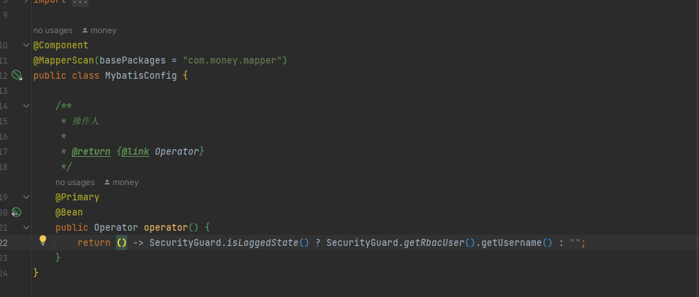
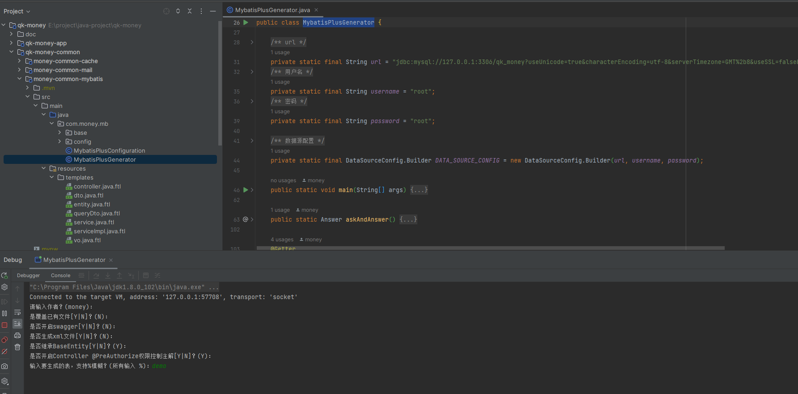
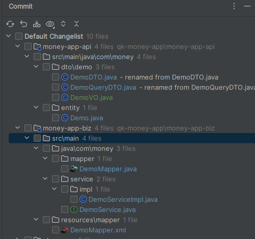

# MyBatis 模块

QK-MONEY 选择使用 MyBatis 作为持久层框架，并引入增强库 MyBatis-Plus，单独封装为一个模块，方便以后替换。

- 默认配置分页插件
- 自动填充功能
- 代码生成器

## 依赖

~~~xml
<!-- 持久层 -->
<dependency>
    <groupId>com.money</groupId>
    <artifactId>money-common-mybatis</artifactId>
</dependency>
~~~

## 功能介绍

#### 自动填充功能

MyBatis-Plus 的 [自动填充功能](https://baomidou.com/pages/4c6bcf/) 可以让我们使用其 API 进行数据库操作时，不必显示的为某些字段设置值，它会根据事先设置的填充方式设置值。QK-MONEY 实现的元对象处理器：com.money.mb.config.MybatisPlusMetaObjectHandler，为以下字段进行值填充。

1. `id`：配置了 [主键策略](https://baomidou.com/pages/e131bd/#spring-boot)，填充雪花 ID。

    ```java
    /**
    * 主键 ID
    */
    @TableId(type = IdType.ASSIGN_ID)
    private Long id;
    ```

2. `create_time` 、`update_time` ：填充当前时间，需为 LocalDateTime 类型。

    ```java
    /**
    * 创建时间
    */
    @TableField(fill = FieldFill.INSERT)
    private LocalDateTime createTime;
    
    /**
    * 更新时间
    */
    @TableField(fill = FieldFill.INSERT_UPDATE)
    private LocalDateTime updateTime;
    ```

3. `create_by` 、`update_by` ：获取 com.money.mb.config.Operator 的 Bean 实例填充，模块默认注入的实例填充空字符串。

    ```java
    /**
    * 创建者
    */
    @TableField(fill = FieldFill.INSERT)
    private String createBy;
    
    /**
    * 更新者
    */
    @TableField(fill = FieldFill.INSERT_UPDATE)
    private String updateBy;
    ```

    > 与权限模块一起使用，通过权限上下文获取当前登录人，如系统模块的实现。
    >
    > 

4. 如果你的实体包含上面的所有字段，可以直接继承提供的 BaseEntity 对象。

#### 代码生成器

提供配套生成 CRUD 代码的代码生成器：com.money.mb.MybatisPlusGenerator，修改连接信息运行 Main 函数即可。



生成目录结构：



# 相关链接

[MyBatis](https://mybatis.org/mybatis-3/)

[MyBatis-Plus](https://baomidou.com/)
