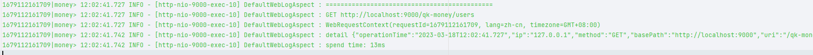

# 通用 Web 模块

该模块是 QK-MONEY 进行 Web 开发的核心模块，提供了许多 Web 开发的通用功能和配置。包含功能如下：

- 默认全局响应返回
- 默认全局异常处理
- 默认请求日志切面
- 全局请求上下文
- 日志链路追踪
- 多语言
- 多时区
- 其他常用工具

## 依赖

~~~xml
<!-- Web 模块-->
<dependency>
    <groupId>com.money</groupId>
    <artifactId>money-common-web</artifactId>
</dependency>
~~~

## 功能结构

每个功能的核心类都在对应的包里。

### constant（常量）

通用的常量

### config（配置）

提供默认 MVC 配置，如支持日期类转换配置、Jackson 配置、跨域等。

### log（请求日志切面）

提供默认全局访问日志切面 `DefaultWebLogAspect`，将一次访问的相关信息输出到单独的日志文件 log/${date}/access.log 。

### context（请求上下文）

自定义过滤器`WebRequestContextFilter`，从请求头中获取请求上下文 `WebRequestContext` ，包括 `requestId(链路追踪)`、`lang(语言)`、`timezone(时区)`，并交由请求上下文持有者 `WebRequestContextHolder` 管理，提供静态方法便于获取。

> 请求头键名在 `WebRequestConstant` 里，并没有提供配置修改，若需使用别的请求头键值直接修改 `WebRequestConstant` 里相应的常量即可。

- `requestId`（提供日志链路追踪使用）

  - 请求日志里最前面打印的就是 `requestId`。在排查线上问题时，可以通过前端传的 requestId 在日志中过滤出当前请求的日志。

- `lang`（客户端语言，为了支持国际化多语言）

- `timezone`（客户端时区，为了支持国际化多时区）

  这两个国际化的支持，当遇到了一些默认提供的支持无法处理的情况，可以自己取出来进行特殊处理。如时区是对返回的数据进行时间转换重写，而对于一些数据量巨大，或有特殊的处理，可以从持有者取出来客户端时区，直接在sql里根据时区查询。

~~~java
WebRequestContextHolder.getContext().getLang(); // 获取上下文的语言环境
~~~

### response（全局响应）

提供默认全局响应处理器 `DefaultResponseHandler`。该处理器的作用是将 Controller 的返回值包装在 `R<T>` 中进行返回，这样的好处是 Controller 开发中无需显示的返回 `R<T>`，开启后如果该请求不需要进行包装，可在类或者方法上添加注解 `IgnoreGlobalResponse`。**而对于返回非 200，建议用抛异常的方式让全局异常处理返回，而不要自己包装非 200 的`R<T>`**

`R<T>` 结构如下

~~~json
{
    "code": 200,
    "data": T,
    "message": "操作成功"
}
~~~

### exception（全局异常）

提供默认全局异常处理器 `DefaultExceptionHandler` 和基础业务异常 `BaseException`。开启后，所有的异常都会被捕获并包装在 `R<T>` 中返回。

| 捕获异常类                                                   | HTTP 状态码 | code   | 描述                                                         |
| ------------------------------------------------------------ | ----------- | ------ | ------------------------------------------------------------ |
| Exception.class                                              | 500         | 500    | 兜底异常                                                     |
| BindException.class \| MethodArgumentNotValidException.class | 400         | 400    | @Valid 校验的参数异常                                        |
| BaseException.class                                          | 200         | 自定义 | 业务异常，开发中业务相关异常只能抛此类或其子类（可继承该类做更细粒度的业务异常划分） |

### i18n（多语言）

提供国际化多语言能力，开启后返回的 `R<T>` 里的 message 会从请求上下文中获取客户端语言从相对应的多语言映射文件中获取并返回对应的语言内容。开启多语言后，项目启动便会加载多语言文件。

使用步骤：

- 开启多语言，配置支持的语言（配置项见相关配置）
  - 未传请求头或找不到支持的语言将原内容返回
- 维护多语言映射文件（路径：classpath:i18n/message_{自己配置的支持语言}.properties）

核心类 `I18nSupport`，可使用 `I18nSupport.get(key)` 硬编码方式获取内容，这可以用于应对内容中有变量的消息提示。

> 目前我自己使用的话，开发中还是写中文，然后如果有配置多语言，properties 里的 key 就是中文。因为如果使用变量的方式，我至少要提供一个中文的映射文件；而使用中文，因为未传请求头或找不到支持的语言将原内容返回，我可以不写中文的映射文件，hhh...

### timezone（多时区）

提供国际化多时区能力，客户时区依旧是从请求上下文中获取。原理就是一个切面 `TimeZoneAspect`，对标注了 `@TZProcess` 的 Controller 的入参（需标注`@TZParam`）和返回值（需标注`@TZRep`）进行时区处理。对于入参是将客户时区转为默认时区，出参是将默认时区转为客户时区，这样保证了进入方法后的所有操作，数据都在默认时区。

> 比如客户是东九区，那他在页面操作的时间都是东九区的时间，所以对于入参我们得转为东八，保证无论客户哪个时区，我们进行操作和存入数据库的时间都是东八区，然后返回的时候将数据洗成客户对应的时区展示。

默认转换器使用的转换工具类是 `TimeZoneUtil`，也可以自定义转换器通过注解的 `converter()` 参数传入。

目前支持的数据类型：

- LocalDateTime
- String（如 2022-05-13 13:15:00，格式可自定义但需是日期时间）
- Map（对包含 time 或者 date 的键进行转换）
- List（递归对泛型类型是目前支持的类型转换）
- PageVO（对 record，其实就是 List 进行转换）

**🌰`TimeZoneDemoController`**

### DTO、VO

一些通用的DTO、VO。

`PageRequest`：分页请求，里面规定了分页请求的键为 *page*、*size*，如果前端就是不要用这两，那就改这个类。

`SortRequest`：排序请求，实现 `ISortRequest`，排序字段为 *sort*，值应如 *createTime,desc;id,asc;* 形式，配备方便获取 order by 语句的方法。

`QueryRequest`：查询请求，即 `PageRequest` + `SortRequest`，供查询DTO继承使用。

`ValidGroup`：验证组，用于数据校验 @Validated 分组

`PageVO`：统一分页返回 VO，返回分页数据应统一为该 VO，`money-app-api`有提供 VOUtil 工具方便转换。

### util（工具类）

`IpUtil`：获取客户端真实 IP 和真实地址

`JwtUtil`：JWT相关工具

`WebUtil`：web工具，如直接通过response流写回

> 还是建议所有工具 Hutool 有的用 Hutool

## 相关配置

~~~yaml
money:
  web:
    # 全局响应处理器
    response-handler: true
    # 全局异常处理器
    exception-handler: true
    # 全局请求日志切面
    web-log-aspect: true
    # 多语言
    i18n:
      enabled: true
      support:
        - en
    # 多时区
    timezone:
      default-time-zone: GMT+08:00
~~~
