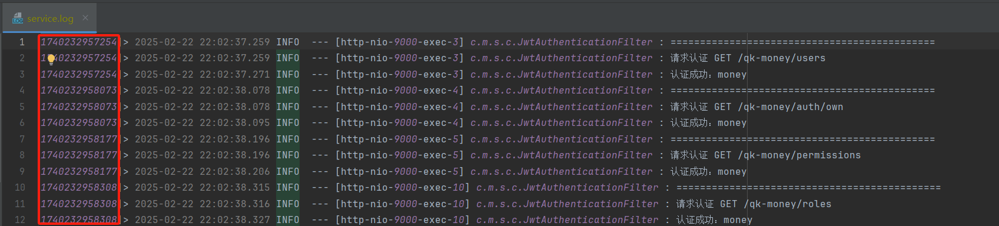

# 通用 Web 模块

该模块是 QK-MONEY 进行 Web 开发的核心模块，提供了许多 Web 开发的通用功能和配置。包含功能如下：

- 默认全局响应处理
- 默认全局异常处理
- 默认请求日志切面
- 全局请求上下文
- 日志链路追踪
- 多语言
- 多时区
- 其他常用工具类

## 依赖

~~~xml
<!-- Web 模块-->
<dependency>
    <groupId>com.money</groupId>
    <artifactId>money-common-web</artifactId>
</dependency>
~~~

## 包结构

```java
|-- qk-money
    |-- qk-money-common
        |-- money-common-web
            |-- com.money.web
                |-- config // 配置（默认 Jackson 配置、mvc 配置等）
                |-- constant // 常量
                |-- context // 请求上下文
                |-- dto // 通用 DTO
                |-- exception // 异常相关，如默认全局异常处理
                |-- i18n // 多语言
                |-- log // 日志相关，如默认请求日志切面
                |-- response // 响应相关，如默认全局响应处理
                |-- timezone // 多时区处理
                |-- util // 常用工具类
                |-- vo // 通用 VO
```

## 功能介绍

#### 默认全局响应处理

通常我们开发的 Rest 接口返回值都会包装在一个 `ResultVO<T>` 对象里，QK-MONEY 也不例外，只不过类名比较简短叫 `R<T>` ：

```json
{
    "code": 200,
    "data": T,
    "message": "操作成功"
}
```

早期常见的是由自己返回包装类的硬编码方式，如：

```java
@Getting("/rest")
public R<Object> rest() {
    return new R<Object>(200, new Object(), "操作成功");
}
```

现在越多越多人采用 Spring Boot 提供的 `ResponseBodyAdvice` 来进行全局响应处理，如 QK-MONEY 实现的 `DefaultResponseHandler` 便统一将返回值进行包装：

```java
// 部分核心代码
@Override
    public Object beforeBodyWrite(Object o, MethodParameter methodParameter, MediaType mediaType, Class aClass, ServerHttpRequest serverHttpRequest, ServerHttpResponse serverHttpResponse) {
        // 当已经是R类型就无需处理
        if (o instanceof R) {
            return o;
        }
        // 当返回类型是String时，用的是StringHttpMessageConverter转换器，无法转换为Json格式
        if (o instanceof String) {
            return DefaultJackson.writeAsString(R.success(o));
        }
        return R.success(o);
    }
```

也就是说，我们的接口无需显示的包装 `R<T>` ，全局响应处理会帮我们包装，即接口书写改为：

```java
@Getting("/rest")
public Object rest() {
    return new Object();
}
```

但是全局响应处理返回的 code 都是 200，如果我们需要返回其他状态码，可以接口直接返回 `R<T>` 或者将 `@IgnoreGlobalResponse` 标注在接口方法或类上，表示忽略全局响应处理，后者更常用于导出接口。

> 返回 code 非 200，建议使用抛异常的方式 `throw new BaseException(RStatus.FAILED) `，由全局异常处理器将其包装至 `R<T>` 中返回。也就是说，在开发中，应该尽量避免使用到 `R<T>`。

#### 默认全局异常处理

全局异常处理是通过 `@RestControllerAdvice` + `@ExceptionHandler` 增强 Controller ，对执行中抛出的异常进行统一拦截和响应返回。QK-MONEY 提供了默认的全局异常处理器 `DefaultExceptionHandler` ，针对以下异常返回包装类 `R<T>`：

| 捕获异常类                                                   | HTTP 状态码 | code   | 描述                                                         |
| ------------------------------------------------------------ | ----------- | ------ | ------------------------------------------------------------ |
| Exception.class                                              | 500         | 500    | 兜底异常，防止暴露意料之外的异常                             |
| BindException.class \| <br />MethodArgumentNotValidException.class \|<br />ConstraintViolationException.class | 400         | 400    | @Valid 校验的参数异常                                        |
| BaseException.class                                          | 200         | 自定义 | 业务异常，开发中业务相关异常应抛此类或其子类（可继承该类做更细粒度的业务异常划分） |

#### 默认请求日志切面

QK-MONEY 提供了一个请求日志切面 `DefaultWebLogAspect`，来记录并打印一次请求的相关信息，包含请求 IP、请求方法、URL、请求参数、返回结果和请求耗时。结合当前 Logback 日志本地化的配置，将其打印在了单独的日志文件中：log/yyyy-MM-dd/access.log。


#### 全局请求上下文 & 日志链路追踪

请求上下文是与调用方（前端）约定的每次请求携带的一些信息，使用请求头进行传递，由过滤器 `WebRequestContextFilter` 进行拦截填充。当前上下文仅包含请求 id、语言和时区，请求头 key 声明在 `WebRequestConstant` 常量中：

```java
public interface WebRequestConstant {

    /**
     * 请求头 请求id
     */
    String HEADER_REQUEST_ID = "X-qk-request";

    /**
     * 请求头 语言
     */
    String HEADER_LANG = "X-qk-lang";

    /**
     * 请求头 时区
     */
    String HEADER_TIMEZONE = "X-qk-timezone";
}
```

我们可以通过上下文持有者获取信息：

```java
WebRequestContextHolder.getContext().getRequestId();
WebRequestContextHolder.getContext().getLang();
WebRequestContextHolder.getContext().getTimezone();
```

其中请求 id 是协助我们定位一次请求相关日志的重要标识，也就是常说的日志链路追踪。结合 MDC（映射调试上下文，Logback 提供的一种方便在多线程条件下记录日志的功能），将请求 id 打入日志。



#### 多语言

提供多语言能力，核心类 `I18nSupport` ，开启后程序启动时会根据配置预加载多语言文件。


```properties
# i18n/messages_en.properties
操作成功=success
操作失败=failure
参数检验失败=Parameter verification failure
暂未登录或token已经过期=Not logged in yet or the token has expired
没有相关权限=No relevant permissions
找不到页面=Page not found
...
```

语言文件需放在 resource/i18n 下，命名方式如 `messages_{支持的语言}.properties`。我这里直接使用中文作为 key，一个是图方便，不用多声明一份中文的映射文件；一个是适用于系统已经开发一部分，原本代码中都是中文的情景。但不适合一些如带有占位符的复杂场景，这种场景可以使用硬编码 `I18nSupport.get` 的方式或映射文件使用常规的变量方式。

多语言的原理就是 `I18nSupport.get` 方法，通过获取上下文中的语言环境，对 `R<T>` 中的 message 和 `BaseException` 的 message 进行多语言映射。


#### 多时区

提供多时区能力，客户时区依旧是从请求上下文中获取。原理就是通过切面 `TimeZoneAspect`，对标注 `@TZProcess` 的 接口入参（需标注 `@TZParam`）和返回值（需标注 `@TZRep`）进行时区处理。对于入参是将客户时区转为默认时区，出参则是将默认时区转为客户时区，这样保证进入方法后的所有操作，数据均为默认时区。

> 比如客户是东九区，那他在页面操作的时间都是东九区的时间，所以对于入参我们得转为东八，保证无论客户哪个时区，我们进行操作和存入数据库的时间都是东八区，然后返回的时候将数据洗成客户对应的时区展示。

默认转换器使用的转换工具类是 `TimeZoneUtil`，也可以自定义转换器通过注解的 `converter()` 参数传入。

目前支持的数据类型：

- Bean（递归成员变量，对标注 `@TZParam` 的字段进行转换）
- LocalDateTime（日期时间类）
- String（如 2022-05-13 13:15:00，格式可自定义但需是日期时间）
- Map（对键包含 time 或者 date 的值进行转换）
- List（循环递归转换）
- PageVO（对 record，其实就是 List 进行转换）

#### DTO 和 VO

`ISortRequest`：排序请求接口，支持提交如 *createTime,desc;id,asc;*  的排序值，并配备转换为 order by 语句的方法。

`PageRequest`：分页请求参数，里面规定了分页请求的键为 *page*、*size* 。

`SortRequest`：排序请求参数，实现 `ISortRequest` ，并设置排序字段为 *orderBy* 。

`PageQueryRequest`：分页查询请求参数，继承 `PageRequest` 和实现 `ISortRequest` ，设置排序字段为 *orderBy* ，供常规分页查询 DTO 继承使用。

`ValidGroup`：验证组，用于数据校验 @Validated 分组。

`PageVO<T>`：统一的分页 VO，money-app-api 提供 `PageUtil` 工具类，方便 MyBatis-Plus 分页对象进行转换。

#### 工具类

`BeanMapUtil`：对象复制工具类，简单包装了一下 Hutool 的 `BeanUtil.copyProperties` 。

`IpUtil`：IP 相关工具类，如获取客户端真实 IP 和地理位置。

`WebUtil`：Web 相关工具类，如获取当前 Request 、Response 对象，使用 Response 直接响应等。

`ValidationUtil`：检验工具类，即对对象进行校验，同 `@Validated`，手动版。

## 相关配置

~~~yaml
money:
  web:
    # 全局响应处理器
    response-handler: true
    # 全局异常处理器
    exception-handler: true
    # 全局请求日志切面
    web-log-aspect:
      enabled: true
      mode: ignore_get_result
    # 多语言
    i18n:
      enabled: true
      support:
        - en
    # 多时区
    timezone:
      enabled: true
      default-time-zone: GMT+08:00
~~~
