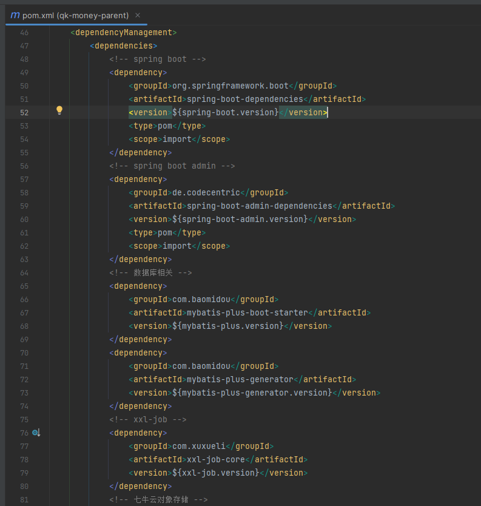

# 父模块
作为工程的父模块，其他模块都直接或间接继承该模块。项目下仅有一个 pom.xml 文件，主要用来管理项目的第三方依赖版本。项目使用的第三方依赖必须在该 pom.xml 下的 <dependencyManagement> 标签内声明版本，如此其他模块引入依赖时则不需要**也不要**声明 <version> 标签。

> 工程自己的模块版本声明在根目录下的 pom.xml 

父工程引入了两个项目必要的依赖，分别是 Lombok 和 Hutool 。Hutool 是一个小而全的 Java 工具类库，通过静态方法封装，降低相关 API 的学习成本，提高工作效率，避免重复造轮子。
~~~xml
<dependencies>
    <dependency>
        <groupId>org.projectlombok</groupId>
        <artifactId>lombok</artifactId>
    </dependency>
    <!-- 工具集 -->
    <dependency>
        <groupId>cn.hutool</groupId>
        <artifactId>hutool-all</artifactId>
    </dependency>
</dependencies>
~~~

# 延伸阅读
[Lombok](https://www.projectlombok.org/features/all)

[Hutool](https://www.hutool.cn/docs/#/)