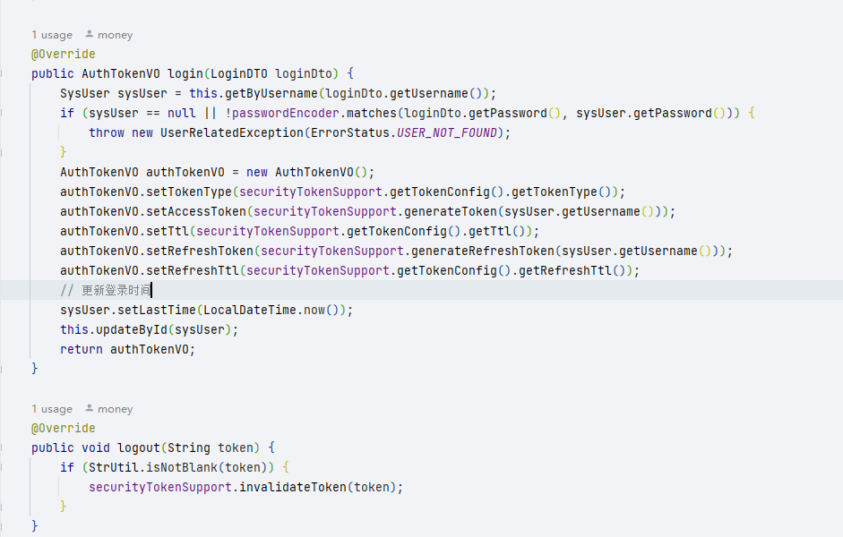
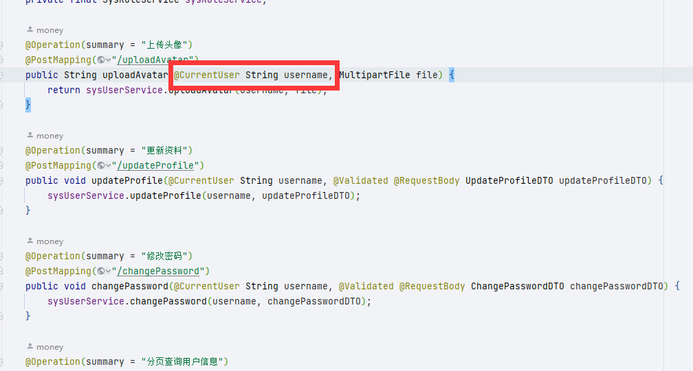
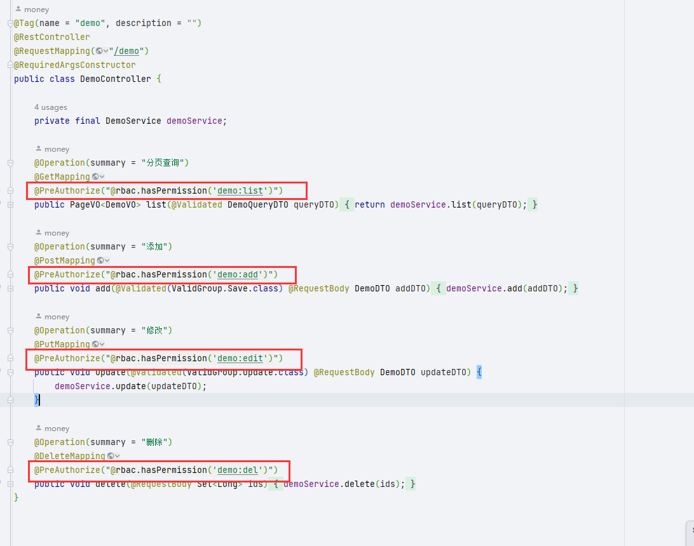

# 安全模块

认证鉴权是每个项目最基础的功能，但是在配置和使用上相对复杂，于是通过封装 Spring Security ，提供基于 Token（JWT）的认证和基于 RBAC 权限模型的鉴权能力，让项目能更便捷的拥有该能力。

> money-app-system 其实就是该模块的一个实现

## 依赖

~~~xml
<!-- 安全模块 -->
<dependency>
    <groupId>com.money</groupId>
    <artifactId>qk-money-security</artifactId>
</dependency>
~~~

## 接入

提供配置类 `RbacSecurityConfig`。模块并不关心你的数据库是如何设计的，它只需要你提供一个 `RbacUser`。

~~~java
@Bean
public RbacSecurityConfig rbacSecurityConfig() {
    return username -> {
        SysUser sysUser = Optional
            .ofNullable(sysUserService.getByUsername(username))
            .orElseThrow(() -> new UsernameNotFoundException("用户名或密码错误"));
        List<SysRole> roles = sysUserService.getRoles(sysUser.getId());
        List<String> roleCodeList = roles
            .stream().map(SysRole::getRoleCode).collect(Collectors.toList());
        List<String> permissions = sysUserService.getPermissions(sysUser.getId())
            .stream().map(SysPermission::getPermission).collect(Collectors.toList());
        // 返回装填的rbac user
        RbacUser rbacUser = new RbacUser();
        // 用户id
        rbacUser.setUserId(sysUser.getId());
        // 用户名
        rbacUser.setUsername(sysUser.getUsername());
        // 用户密码
        rbacUser.setPassword(sysUser.getPassword());
        // 是否启用
        rbacUser.setEnabled(sysUser.getEnabled());
        // 角色
        rbacUser.setRoles(roleCodeList);
        // 权限码
        rbacUser.setPermissions(permissions);
        return rbacUser;
    };
}
~~~

## 相关配置

~~~yaml
money:  
  # 安全
  security:
    # Token 配置
    token:
      # Token 请求头键名
      header: Authorization
      # 令牌类型：完整 Token："{tokenType} {accessToken}"
      token-type: Bearer
      # 密钥
      secret: money
      # Access Token 过期时间（ms），默认8小时
      ttl: 28800000
      # Refresh Token 过期时间（ms），默认30天
      refresh-ttl: 2592000000
      # 策略：jwt（自动过期，默认）、redis
      strategy: jwt
      # 缓存键名前缀
      cache-key: "security:token:"
    # 忽略的 URL
    ignore:
      get:
        - /tenants/byCode
        - /auth/refreshToken
      post:
        - /auth/login
        - /auth/logout
      pattern:
        - /error/**
        - /actuator/**
        - /swagger**/**
        - /webjars/**
        - /v3/**
        - /assets/**
~~~

## 认证

认证主要由过滤器`JwtAuthenticationFilter` 实现，过程如下

1. 获取头部的 Token
2. 解析出用户名
3. 调用配置的 `RbacSecurityConfig` 进行认证
4. 认证成功，用户信息放入上下文

### Token

~~~java
// 注入该类使用
private final SecurityTokenSupport securityTokenSupport;
~~~

该类提供了生成、刷新、删除、验证、获取 Token 信息的方法。用户登录后，通过该类生成 Token，如

对于过期，如果策略使用的是 `jwt` 则无法手动过期，`redis` 策略才能手动过期。策略也可以自己扩展，实现 `TokenStrategy` 即可，如 `redis` 策略实现如下：

~~~java
@Component
@ConditionalOnProperty(prefix = "money.security.token", name = "strategy", havingValue = "redis")
@RequiredArgsConstructor
public class TokenStrategyByRedis implements TokenStrategy {

    private final StringRedisTemplate redisTemplate;

    @Override
    public void saveToken(String key, String token, long timeout, TimeUnit unit) {
        redisTemplate.opsForValue().set(key, token, timeout, unit);
    }

    @Override
    public boolean isExpired(String key, @NonNull String targetToken) {
        String token = redisTemplate.opsForValue().get(key);
        return !targetToken.equals(token);
    }

    @Override
    public void invalidateToken(String key, String token) {
        redisTemplate.delete(key);
    }
}
~~~

然后配置文件中策略名改为你设置的 havingValue 即可。

### 密码加密器

~~~java
// 注入该类使用
private final PasswordEncoder passwordEncoder;
~~~

### 获取当前用户信息

1. 通过上下文持有者 `SecurityGuard` 安全保安

    ~~~java
    SecurityGuard.getRbacUser()
    ~~~

2. 通过 Controller 的入参注解 `@CurrentUser`

    > ~~~java
    > /**
    >  * 标记当前登录用户信息
    >  * <pre>
    >  * 在 Controller 方法参数上使用此注解，可自动注入当前登录用户信息
    >  * 参数类型为 {@link com.money.security.model.RbacUser} 时注入 RbacUser
    >  * 参数类型为 Long 时注入用户ID
    >  * 参数类型为 String 时注入用户名
    >  * </pre>
    >  *
    >  * @author : money
    >  * @since : 1.0.0
    >  */
    > @Target(ElementType.PARAMETER)
    > @Retention(RetentionPolicy.RUNTIME)
    > public @interface CurrentUser {
    > }
    > ~~~
    >
    > 

## 鉴权

鉴权的核心类是 `RbacAuthorityService`，其原理就是通过配置的 `RbacSecurityConfig` 返回的 `RbacUser` 中的角色和权限码与**注解**提供的权限码比较来判断是否放行。

注解都是 Spring Security 提供的注解，更多使用查阅其[相关资料](https://docs.spring.io/spring-security/site/docs/5.0.x/reference/html/el-access.html#filtering-using-prefilter-and-postfilter)即可。
