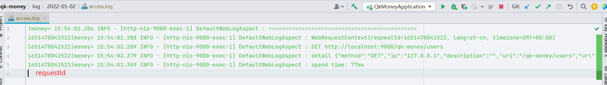

# money-common-web(通用web模块)

​		提供web开发的一些通用能力。

## 功能结构

### constant

​		`qk-money`通用常量

### config

​		提供默认web配置，如支持日期转换配置、Jackson配置、跨域。

### log

​		提供默认全局访问日志切面`DefaultWebLogAspect`，将一次访问的相关信息输出日志。日志单独放在 ${date}/access.log

### context

​		提供web请求上下文`WebRequestContext`，包括`requestId(链路追踪)`、`lang(语言)`、`timezone(时区)`。**默认日志切面**会从**请求头**取得信息，并交由`WebRequestContextHolder`管理。所以**上下文需开启默认日志切面才能使用**。

> 请求头键名在`WebRequestConstant`里，并没有提供配置修改。若需使用别的请求头键值直接修改`WebRequestConstant`里相应的常量。

- `requestId`（提供日志链路追踪使用）

  - 如**log**描述的图片，请求日志里最前面回打印`requestId`，在排查线上问题时，可以在前端F12查看请求中请求头的`requestId`，在查看日志时用grep进行过滤。这样做是因为日志是异步打印，线上环境没法阻止其他人请求，会导致日志混在一起不好排查，而通过grep requestId就可以捞到这次请求的所有日志。

- `lang`（客户端语言，为了支持国际化多语言）

- `timezone`（客户端时区，为了支持国际化多时区）

  这两个国际化的支持，当遇到了一些默认提供的支持无法处理的情况，可以自己取出来进行特殊处理。如时区是对返回的数据进行时间转换重写，而对于一些数据量巨大，或有特殊的处理，可以从持有者取出来客户端时区，直接在sql里根据时区查询。

~~~java
WebRequestContextHolder.getContext().getLang(); // 获取上下文的语言环境
~~~

### response

​		提供默认全局响应处理器`DefaultResponseHandler`。该处理器的作用是将Controller的返回值包装在`R<T>`中进行返回，这样的好处是Controller开发中无需显示的返回`R<T>`，开启后如果该请求不需要进行包装，可在类或者方法上添加注解`IgnoreGlobalResponse`

`R<T>`结构如下

~~~json
{
    "code": 200,
    "data": T,
    "message": "操作成功"
}
~~~

### exception

​		提供默认全局异常处理器`DefaultExceptionHandler`、和基础异常`BaseException`。所有的业务异常均抛`BaseException`或其子类（可自己继承去进行更细粒度的业务异常区分）。开启后，所有的异常都会被捕获并包装在`R<T>`中返回。

### i18n

​		提供国际化多语言能力，开启后返回的**`R<T>`(默认全局异常捕获后返回的也是`R<T>`)里的message**会根据**请求头里客户端设置的语言**从相对应的**多语言映射文件**中获取并返回对应的语言内容。

所以他需要的**前置条件**有：

- 开启多语言，配置支持的语言（配置项见相关配置）
- 开启默认全局异常处理器（抛出异常信息）和默认全局响应处理器（返回的信息）
- 维护多语言映射文件（路径：classpath:i18n/message_{自己配置的支持语言}.properties）

核心类`I18nSupport`，可使用`I18nSupport.get(key)`硬编码方式获取内容，这可以用于应对内容中有变量的消息提示。

> 开启多语言后，项目启动便会加载多语言文件；

### timezone

建设中...

### dto、vo

一些通用的DTO、VO。

`PageRequest`：分页请求，里面规定了分页请求的键为 page、size，如果前端就是不要用这两，那就改这个类。

`QueryRequest`：查询请求，继承`PageRequest`、查询DTO继承这个，它除了继承后的分页，还提供的`sort`排序字段，配备方便获取order by语句的方法。

`ValidGroup`：验证组，用于数据校验@Validated分组

`PageVO`：统一分页返回的VO，分页的返回需使用这个包装。

### util

常用工具：**还是建议所有工具Hutool有的用Hutool**，这里是一些Hutool里没有但有用的工具。

`IpUtil`：获取客户端真实IP、和真实地址

`JwtUtil`：JWT相关工具

`WebUtil`：web工具，如直接通过response流写回

## 相关配置

~~~yaml
money:
  web:
    # 全局响应处理器
    response-handler: true
    # 全局异常处理器
    exception-handler: true
    # 全局请求日志切面
    web-log-aspect: true
    # 多语言
    i18n:
      enabled: true
      support:
        - en
~~~

